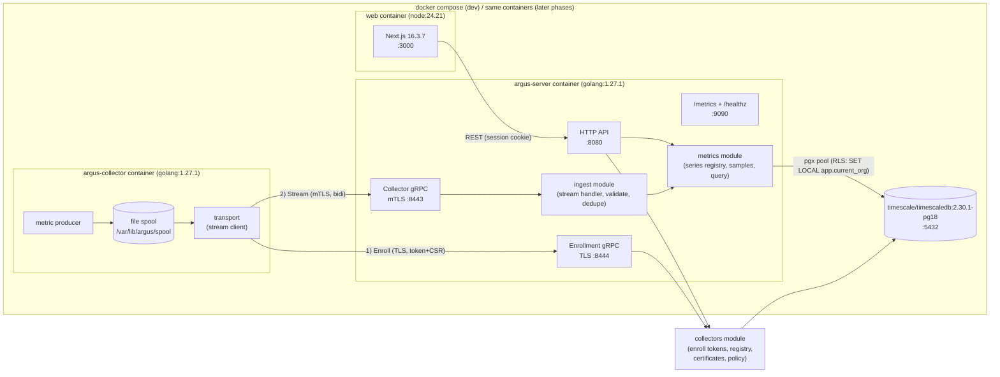
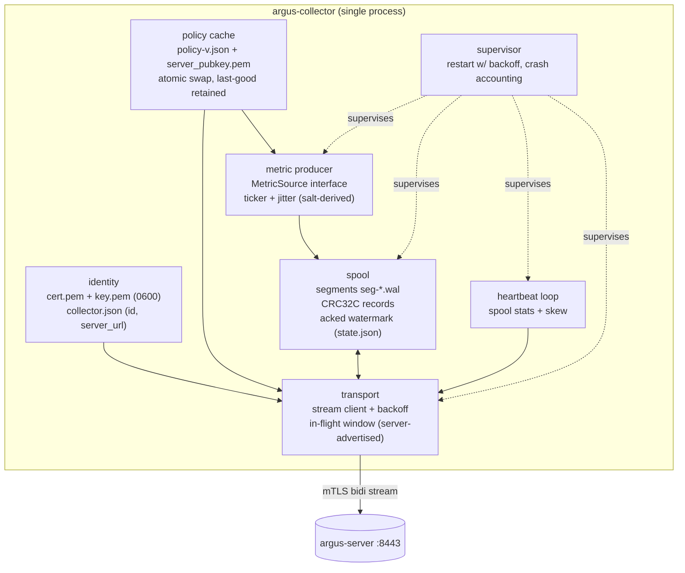
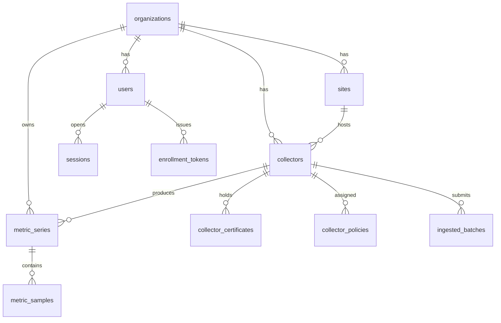
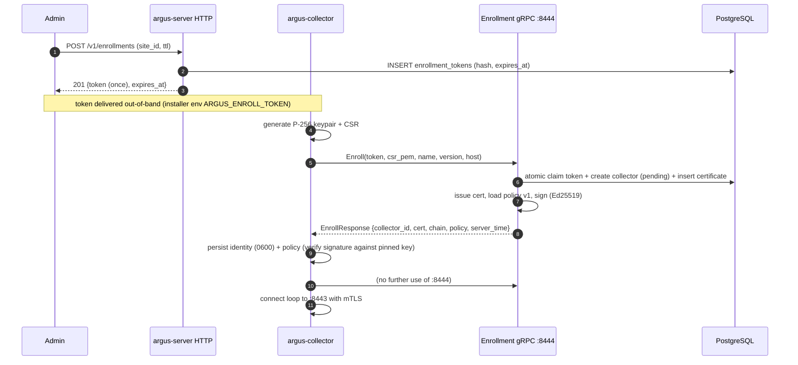
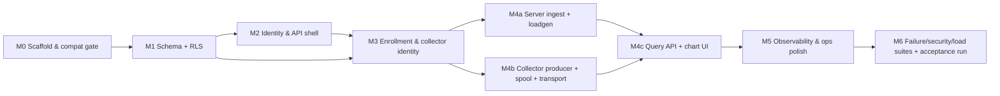

# PHASE-1 ENGINEERING SPECIFICATION
## Walking Skeleton — Argus Network Observability Platform

**Status:** Implementation-ready specification. Code begins only after the consistency review at the end of this document passes (it does — see §19) and the companion file plan is accepted.
**Inputs (read first, do not redesign):** `../argus-platform-spec/ARCHITECTURE.md` (canonical architecture; ADRs 1–15), `../argus-platform-spec/docs/20-roadmap-build-order.md` (THE BUILD ORDER, Step 1).
**Companions:** `PHASE_1_FILE_PLAN.md`, `PHASE_1_ACCEPTANCE.md`, `PHASE_1_SECURITY.md`, `PHASE_1_FAILURE_TESTS.md`, `PHASE_1_LOAD_TEST.md`, `ADR_REVIEW.md`, `../proto/argus/collector/v1/collector.proto`, `../openapi/argus.v1.yaml`, `../migrations/`.

---

# 1. PHASE-1 ARCHITECTURE GATE

Every decision below is either *adopted from the architecture package* or an *explicit Phase-1 deviation*. Nothing is silently ignored.

## 1.1 Gate table (Decision · Evidence · Conflict · Resolution)

| ID | Decision | Evidence | Conflict / deviation | Resolution |
|---|---|---|---|---|
| G1 | **Prove the collector spine exactly as specified**: outbound-only mTLS gRPC (HTTP/2, port 443-class) with collector-owned durable spool, ack-gated deletion, idempotent server ingress. | ADR-005, ADR-014; §27.4; Prometheus-agent/Vector/Telegraf buffer precedents (sources in architecture §Sources). | None. This is the riskiest path — that is why it is Step 1. | Implement as specified; single collector per site (no HA lease yet, see G3). |
| G2 | **NATS JetStream is NOT deployed in Phase 1.** Ingest writes to PostgreSQL directly through module interfaces. | ADR-014 (internal bus); §9.6.1 pipeline. | Architecture diagrams show API→NATS→workers. In Phase 1 there are no async consumers; adding a bus proves nothing extra and risks masking DB behavior. | Collapse the bus out of the critical path. Keep the `ingest` module boundary clean so publishing to NATS later is additive (Phase 2), not a rewrite. Re-validate ADR-014's internal half in Phase 2. |
| G3 | **Single collector per site; HA leader-lease deferred.** Collector autonomous during cloud outage is still proven. | ADR-005; §27.7 (HA pair). | HA pair is recommended in the architecture but is orthogonal to the spine; two collectors would complicate failover tests without validating new failure physics. | Defer lease/leader election to the later build-order step 16. Phase 1 collector has no lease fields; `collectors` table gains them in a later migration. |
| G4 | **Enrollment runs on a separate TLS listener (8444, server-auth only) from the mTLS collector stream (8443).** Same process. | §27.3 (token→CSR→90-day cert); §24.6 (mTLS). | The architecture implies one authenticated surface; you cannot require a client certificate from a collector that does not have one yet. | Two listeners in one process. Enrollment is token-gated, rate-limited, and audited. Document in ADR-005 Phase-1 note (see `ADR_REVIEW.md`). |
| G5 | **`metric_samples` carries a denormalized `org_id` (NOT NULL) and a row-level security policy on it.** | §24.4 (RLS as last line of defense); §20.2 (tenant isolation at data layer); PostgreSQL RLS docs. | Architecture §21 DDL for `metric_samples` has no `org_id` (tenant inferred via `metric_series`). RLS via join-subquery on a hypertable is slow and fragile; backfilling `org_id` later at 100k devices is a massive, risky migration. | **Required schema amendment**: add `org_id` to `metric_samples` now, RLS on it directly. Recorded as an amendment to ADR-004/architecture §21 (see `ADR_REVIEW.md`). Cost: 16 bytes/sample pre-compression — accepted and documented. |
| G6 | **TimescaleDB is included in Phase 1** (hypertable for samples; no compression/retention policies yet). | ADR-004; architecture §13.4. | Phase 1 could use a plain partitioned table, but then the ADR-004 assumptions (ingest path, hypertable uniqueness rules, ON CONFLICT semantics) go untested until later. | Include TimescaleDB, pin image `timescale/timescaledb:2.30.1-pg18` (PG18 compatibility verified via official image tags). Compression/retention/CAGGs deferred to Phase 2 with measured evidence. Note: 2.30.1 contains fixes for `INSERT … ON CONFLICT` with multiple unique constraints and `NULL` conflict resolution — directly relevant to our idempotent ingest (release notes, 2026). |
| G7 | **Object storage, PostGIS, Redis: not deployed.** | §9.2/§9.4 (both optional/non-critical); §20.1 (spatial for floor plans only). | None material. | Defer with zero design debt: no blobs exist yet; no spatial data exists yet; Redis is already declared non-critical in the architecture. |
| G8 | **Authorization is a two-role stand-in** (`admin`, `viewer`) on the user row. | §6 (RBAC-SC full model). | Full RBAC-SC (bindings, scopes, conditions) is deferred, but **tenant isolation must not be deferred** — it is the security claim Phase 1 proves. | Keep the role column as a Phase-1 stand-in; enforce org scoping through RLS + server-side checks and prove it with the isolation test suite. Full RBAC-SC arrives with the identity milestone in later phases; capability checks replace the role check at call sites with no schema rewrite (role column is superseded, not removed). |
| G9 | **Policy bundles are signed (Ed25519) from day one**; collector pins the server public key from enrollment. | §27.3 (signed policy bundles); §24.6 (defense in depth beyond TLS). | Slightly more Phase-1 work (~1 day) than unsigned JSON. | Keep signing: it is cheap now, establishes the trust chain, and failure-test T7 (revocation) plus policy-integrity tests need it. |
| G10 | **Human authN: local email+password (Argon2id) + server-side sessions. OIDC/SAML/MFA deferred.** | §24.3; §6.1. | Architecture prefers federated identity; Forge-1 only needs a minimal login for the UI + API. | Implement local auth with production-grade primitives (Argon2id, hashed session tokens, CSRF double-submit); federated flows are Phase 2 without API changes (sessions remain the session mechanism). |
| G11 | **Realtime UI: no SSE in Phase 1.** Collector list and charts fetch on load + explicit refresh (and a 10 s auto-refresh poll for the collector list only). | §23.7 (SSE); §22.16. | SSE is the architecture's realtime mechanism; deferring it does not invalidate any Phase-1 acceptance criterion. | Defer to Phase 2 (first consumer: alert queue). UI code isolates fetching so the SSE client is additive. |
| G12 | **Ingest write path: array-unnest + `ON CONFLICT DO NOTHING` inside one transaction per batch; batch claim via `ingested_batches` PK.** | §13 (idempotency), §34.1; pgx batching; Timescale 2.30.1 conflict fixes (G6). | Architecture suggests bulk/batched ingest; `COPY` has no `ON CONFLICT`, so the idempotency requirement forces `INSERT … ON CONFLICT` in Phase 1. | Use unnest-based multi-row `INSERT … ON CONFLICT (series_id, ts) DO NOTHING`; document the measured ceiling and the Phase-2 optimization path (staging table + `COPY` + `INSERT … SELECT ON CONFLICT` or Timescale tooling) in `PHASE_1_LOAD_TEST.md`. |
| G13 | **Framework for exactly one metric source: `collector_cpu_percent`** (host CPU of the collector itself). | §13.2 (metric model); user brief §12. | Real device metrics (SNMP) are Step 5+ of the build order; the skeleton needs *a* deterministic producer. | Implement a `MetricSource` interface (`Sample() []Sample`) with one implementation; SNMP/ICMP sources plug in later without touching spool/transport/ingest. |
| G14 | **Certificate renewal RPC deferred; 90-day certs issued, expiry surfaced.** | §27.3 (renew at 60 d). | Renewal is a Phase-2 feature; Phase-1 dev cycles are shorter than 90 days. | Defer renew; monitor `cert_not_after` in `collectors` detail API + platform metrics (acceptance checks expiry is surfaced). |
| G15 | **Migration tool: golang-migrate v4.20.1 with `.up.sql`/`.down.sql` pairs; expand/contract policy enforced by review, not by the tool.** | Architecture §36/§37 (migrations policy). | None. | Down migrations exist for dev; production policy remains forward-only with compensating migrations (documented in SPEC §8.1). |

## 1.2 Assumptions Phase 1 exists to validate (or falsify)

| # | Assumption | Validated by |
|---|---|---|
| A1 | Collector survives server outage with bounded, durable, lossless spool + idempotent replay | Failure tests T2/T3/T10; acceptance AC-05…AC-09 |
| A2 | mTLS cert identity + one-time token enrollment gives a clean, non-repudiable collector identity | Failure tests T6/T7; security tests S-01…S-04 |
| A3 | Signed, versioned policy bundles can be applied atomically by the collector pre-spool | Security test S-05; acceptance AC-02 |
| A4 | PostgreSQL RLS + `SET LOCAL` transaction discipline is pooler-safe and prevents cross-tenant reads/writes | Failure test T8; security tests S-06/S-07 |
| A5 | TimescaleDB hypertable + `ON CONFLICT (series_id, ts)` delivers correct idempotent ingest | Failure tests T4/T9; load test L-01 |
| A6 | 20k samples/s is reachable on the reference single-node dev topology before optimization | Load test L-01/L-02 (direction, not production proof) |
| A7 | Ack-after-commit semantics never acknowledge data that a crash can lose | Failure tests T2/T9 + kill-the-server-mid-batch test |

## 1.3 Required architecture updates before/during implementation

1. **Schema amendment (G5):** add `org_id` to `metric_samples`. Update architecture §21 catalog row + DDL excerpt, note the storage-cost trade-off. (Amendment recorded in `ADR_REVIEW.md`; ADR-004 consequence note.)
2. **ADR-005 Phase-1 note (G3/G4):** two listeners; HA deferred; renewal deferred.
3. **ADR-014 Phase-1 note (G2):** internal NATS half validated later; external gRPC half validated here.
4. **Version baseline confirmation (G6, §5):** PG18 + TimescaleDB 2.30.1 pinned; PostGIS deferred.
5. No other architecture changes are required for Phase 1.

---

# 2. PHASE-1 SCOPE

**In scope (must prove the spine):** collector, control/API server, ingest module, metric storage, enrollment + identity, policy delivery, durable spool, mTLS gRPC transport, minimal REST API, minimal web UI, migrations, local dev environment, self-observability.

**Explicitly out of scope (deferred, with the phase that owns each):**

| Component | Phase 1? | Reason for deferral |
|---|---|---|
| Discovery | **NO** | Step 9 of build order. Nothing to discover until polling exists. |
| SNMP | **NO** | Step 5. Phase-1 metric source is collector-local CPU; SNMP brings template engine + MIB tooling, which deserve their own milestone. |
| ICMP | **NO** | Step 5. Requires raw sockets/capabilities and probe scheduling semantics not needed to prove the spine. |
| Topology | **NO** | Steps 10–11. Depends on discovery + SNMP/FDB data. |
| Heatmap | **NO** | V2. Depends on floor plans + surveys. |
| Alerting | **NO** | Step 7. Threshold evaluation needs the metric store stable first; Phase 1 proves storage integrity, not rules. |
| Diagnostics | **NO** | Step 12. Requires multi-probe executors and evidence schema. |
| RCA | **NO** | V2. Requires topology + alerts + diagnostics as evidence sources. |
| Wi-Fi | **NO** | Step 15. Vendor adapters/build-out. |
| Configuration backup | **NO** | V2. Requires SSH/API adapters and object storage. |
| AI | **NO** | V3. Absolutely nothing in Phase 1 depends on it. |
| HA collector pair / leader lease | **NO** | Build-order step 16 (G3). |
| SSE / realtime push | **NO** | G11; first realtime consumer arrives with alerts (Step 7). |
| OIDC/SAML/MFA | **NO** | G10; local auth is sufficient for the skeleton. |
| PostGIS / floor plans | **NO** | G7. |
| Object storage | **NO** | G7. |
| Redis | **NO** | G7. |
| NATS JetStream | **NO** | G2. |
| Compression / CAGGs / retention policies | **NO** | G6; Phase 2 with measured data. |
| Certificate renewal RPC | **NO** | G14; expiry is surfaced and monitored instead. |
| Nmap/deep scan, flows | **NO** | V3 per architecture. |

**Partially in scope (minimal viable form):** authN (local only), RBAC (role column only, RLS full), web UI (4 views), observability (core metrics + structured logs), load testing (single-node generator), CI (all specified stages), Windows collector support (build target compiled; runtime validation Linux-only in Phase 1).

---

# 3. EXACT PHASE-1 ARCHITECTURE

## 3.1 Deployment view (local dev = production topology, scaled to one machine)



**Written explanation.** One server process exposes four listeners (HTTP 8080 for the web/API, 8443 mTLS for collectors, 8444 TLS for enrollment, 9090 ops). One collector process enrolls once, then maintains a single outbound bidirectional gRPC stream. The web container is a plain API client. TimescaleDB is the only stateful dependency. NATS/Redis/object storage are deliberately absent (G2/G7); the module boundaries that would publish to them already exist in-code.

## 3.2 Collector internal structure (the user-supplied sketch, made concrete)



Ordering guarantee: **the producer never sends anything before it is durably spooled** (fsync policy: group commit ≤ 250 ms or 100 records, whichever first; dev default 1 s). The transport reads from the spool; the network is never in the write path.

## 3.3 Process boundaries (and why)

| Component | Form | Rationale |
|---|---|---|
| `argus-server` (API + collectors module + ingest + metrics query) | **One process** (modular monolith, ADR-001) | Phase 1 has no scale conflict; one process proves the interfaces. Ingest CPU work is bounded (validation + SQL); a later extraction trigger (architecture §9.5) applies only at measured scale. |
| `argus-collector` | **Separate binary/process/container** (ADR-005) | Runs on customer infrastructure, different lifecycle, network position, and trust level. Must be independently restartable/upgradable. |
| `web` | **Separate process** (Next.js) | Standard frontend runtime; no privileged access. |
| TimescaleDB | **Container** | Single stateful dependency. |
| Migrations | `argus-server migrate` subcommand (golang-migrate library) + `migrate` CLI in CI | Same artifact ships schema, avoiding version skew. |

**Explicitly not processes in Phase 1:** ingest, metrics, collectors, identity — they are Go packages wired in `cmd/argus-server`. No message broker process, no sidecars.

## 3.4 Ports and protocol matrix

| Listener | Port | Auth | Protocol | Who talks to it |
|---|---|---|---|---|
| HTTP API + web BFF | 8080 | Session cookie or (dev-only) none for `/v1/healthz` | HTTP/1.1 + JSON | Browser, curl, tests |
| Collector stream | 8443 | mTLS (`RequireAndVerifyClientCert`, custom verify → fingerprint→collector) | gRPC over HTTP/2 | Collectors |
| Enrollment | 8444 | TLS server-auth + one-time token + rate limit | gRPC over HTTP/2 | Collectors (once) |
| Ops | 9090 | Loopback/network-policy only | HTTP (`/metrics`, `/healthz`, `/readyz`) | CI, Prometheus later |
| PostgreSQL | 5432 | Password (dev) / TLS+SCRAM (prod later) | PG wire | Server only |

## 3.5 Startup / shutdown ordering (normative)

**Server:** config validate → DB connect + migrate check (`schema_migrations` up-to-date, refuse to serve if behind) → CA load-or-create → listeners start (ops health first: `/readyz` returns 503 until DB ping OK) → accept traffic.
**Collector:** config validate → identity present? (else enroll path) → policy cache load (else fetch on first stream) → spool open + recovery scan → transport connect loop starts → producer starts **only after** spool recovery completes (no writes before recovery; corrupt-tail truncation is logged and counted).
**Shutdown:** SIGTERM → stop accepting new work → collector: producer stops, in-flight batch finished or left in spool, spool fsync, stream close. Server: HTTP drain (10 s), stream handlers finish current batch (or clients reconnect; spool covers), DB pool close.

## 3.6 Configuration surface (environment; no hidden config files)

| Var | Process | Default (dev) | Notes |
|---|---|---|---|
| `ARGUS_SERVER_DB_DSN` | server | `postgres://argus_app_login:devpass@db:5432/argus?sslmode=disable` | App role member of `argus_app` (RLS-enforced) |
| `ARGUS_SERVER_AUTH_DB_DSN` | server | `postgres://argus_auth_login:devpass@db:5432/argus?sslmode=disable` | Pre-auth lookup role member of `argus_auth` |
| `ARGUS_SERVER_MIGRATE_DSN` | server (migrate only) | `postgres://argus_owner:devpass@db:5432/argus?sslmode=disable` | Owner role; never used at runtime |
| `ARGUS_SERVER_HTTP_ADDR` / `_GRPC_ADDR` / `_ENROLL_ADDR` / `_OPS_ADDR` | server | `:8080` / `:8443` / `:8444` / `:9090` | |
| `ARGUS_SERVER_CA_DIR` | server | `/var/lib/argus/ca` | Created on first boot (0600 keys) |
| `ARGUS_SERVER_POLICY_SIGNING_KEY` | server | generated+cached in `CA_DIR` | Ed25519 |
| `ARGUS_SERVER_SESSION_TTL` | server | `12h` | |
| `ARGUS_COLLECTOR_SERVER` | collector | `https://server:8444` + `server:8443` derived | |
| `ARGUS_COLLECTOR_DATA_DIR` | collector | `/var/lib/argus` | identity + spool |
| `ARGUS_COLLECTOR_SPOOL_MAX_BYTES` | collector | `67108864` (64 MiB) | Pre-SNMP scale |
| `ARGUS_COLLECTOR_FSYNC_INTERVAL_MS` | collector | `1000` | Group commit window |
| `ARGUS_ENROLL_TOKEN` | collector (first boot only) | — | Consumed, then unset |

---

# 4. DOMAIN MODEL (Phase 1)

## 4.1 Entities and authority

| Entity | Authoritative writer | Purpose / Phase-1 behavior |
|---|---|---|
| `organizations` | Server (admin/seed) | Tenant root. Phase 1: seeded single org (dev), one row per test tenant in isolation tests. |
| `sites` | Server | Location anchor; collector site binding. Phase 1: one seeded site per org. |
| `users` + `sessions` | Server | Human access to API/UI; roles `admin`/`viewer` stand-in (G8). |
| `enrollment_tokens` | Server | One-time, expiring, hashed enrollment authority. Issued by admin via API; consumed atomically at enroll. |
| `collectors` | Server | Collector registry: name, site, status lifecycle, versions, last heartbeat/stream, policy version pointer, reported stats. |
| `collector_certificates` | Server | Issued cert records: serial, SHA-256 fingerprint (mTLS identity map key), validity, revocation time. |
| `collector_policies` | Server | Versioned signed policy documents per collector. Version monotonic; collector acks; last-good retained client-side. |
| `metric_series` | Server (created at first ingest) | Series registry: `(org, collector, device?, metric_key, dim_hash)` identity. Phase 1: `device_id` always NULL. |
| `metric_samples` | Server (ingest only) | Timescale hypertable of `(series_id, ts, value)` + denormalized `org_id` (G5). Append-only. |
| `ingested_batches` | Server (ingest claim) | Idempotency ledger: PK `(collector_id, batch_seq)`; claim-first pattern (G12). |
| Collector-spool state | **Collector** (authoritative) | Segment files + `state.json` ack watermark. Server never assumes; it only acks. |

**Lifecycles.** Collector: `pending` (enrolled, never streamed) → `active` (heartbeat < 3× interval) → `stale` (no heartbeat > 3× interval; computed, shown) → `revoked` (terminal until re-enrolled). Enrollment token: `issued → used | expired` (single row; atomic `used_at` claim). Policy: `version N` applied → acked; server never edits a version, only appends N+1.

## 4.2 ERD



## 4.3 Phase-1 metric model (and its evolution)

```text
metric_key:  collector_cpu_percent          (string, allowlisted by policy)
unit:        percent
value:       double (0..100)                (validated range)
ts:          timestamptz (collector clock, |ts-now| <= 7d enforced)
series:      (org_id, collector_id, metric_key, dimensions {"cpu":"total"}, dim_hash)
```

**Evolution path (no schema rewrite):** `metric_series.device_id` exists and is NULL in Phase 1; Phase 5 (SNMP) sets it and adds `dimensions` like `{"if":"ether1"}`. The `MetricSource` interface, `metric_key` registry, and spool/transport contracts are device-agnostic by construction; nothing in Phase 1 assumes the producer is the collector itself.

---

# 5. TECHNOLOGY PINNING (verified 2026-09-29 against official sources)

**Rule: no floating versions.** Direct dependencies are pinned in `go.mod`/`package.json` to the exact versions below; transitive dependencies are pinned by `go.sum`/lockfile; a generated `docs/phase-1/VERSIONS.md` records the matrix (command: `make versions`). Container images are pinned by tag **and digest** at implementation time (M0).

| Layer | Pin | Verified how / compatibility notes |
|---|---|---|
| Go toolchain | **go1.27.1** | `go.dev/dl` JSON (stable channel), 2026-09-29. `go.mod`: `go 1.27`, `toolchain go1.27.1`. |
| gRPC | **grpc-go v1.84.0** | Official release (GitHub API). |
| Protobuf runtime/codegen | **protobuf-go v1.36.12** (`protoc-gen-go`); **buf v1.73.0** (lint+gen orchestration, pins plugin versions in `buf.gen.yaml`) | Official releases. `protoc-gen-go-grpc` pinned in `buf.gen.yaml` and frozen in M0. |
| PG driver | **pgx v5.11.0** | Official release; native `SET LOCAL`, pool, `unnest` array binding. |
| DB | **PostgreSQL 18 + TimescaleDB 2.30.1**, image `timescale/timescaledb:2.30.1-pg18` | Docker Hub tags (official) show `2.30.1-pg18`; release notes confirm fixes to `INSERT … ON CONFLICT` conflict handling relevant to G12. |
| Migrations | **golang-migrate v4.20.1** (embedded as library + CLI in CI) | Official release. |
| UUIDv7 | **github.com/google/uuid v1.6.0** (`uuid.NewV7()`) | Official release. DB does **not** generate IDs (portability across PG majors). |
| Metrics (platform) | **prometheus/client_golang v1.24.1** | Official release; `/metrics` on ops listener. |
| Rate limiting | **golang.org/x/time v0.16.0** | Official repo tags. |
| Crypto (Argon2id, HKDF) | **golang.org/x/crypto v0.57.0** | Official repo tags. |
| Concurrency helpers | **golang.org/x/sync v0.23.0** (`errgroup`) | Official repo tags. |
| Testing (Go) | **testify v1.12.1** + stdlib `testing`; **testcontainers-go v0.44.0** for DB integration tests | Official releases. |
| Load testing | **k6 v2.3.0** (API leg) + Go load generator (gRPC leg, uses repo's own generated client) | Official release. |
| Node.js | **24.21.0 LTS** (current active LTS at 2026-09-29; Node 26 becomes LTS 2026-10-28 — deliberately not pinned) | endoflife.date API. |
| Next.js | **16.3.7** | npm registry `latest`. Engines `node >=20.9` ✓ with Node 24. Peer deps require React `^18.2 || ^19` ✓. |
| React / react-dom | **19.3.0** (with `@types/react` 19.3.0) | npm registry. |
| TypeScript | **7.0.2** (GA `latest`) | npm dist-tags. *M0 check:* run `next build` with TS7; if the Next toolchain flags incompatibilities, fall back to the newest 5.x line from the registry and record the change in `VERSIONS.md`. |
| Charts | **ECharts 6.1.0** | npm registry. |
| E2E (web) | **@playwright/test 1.63.0** | npm registry; also a declared Next.js peer. |
| Containers | Docker Engine ≥ 27, Compose v2 | Requirement (developer machines); digests pinned in `deployments/compose/docker-compose.dev.yml` during M0. |
| Logging | Go stdlib `log/slog` (JSON handler), no third-party logger | Reduces dependency surface; correlation ID convention in SPEC §15. |
| Tracing/metrics approach | Prometheus exposition (`/metrics`) + structured logs; OpenTelemetry SDK **deferred** to Phase 2 (decision G7-adjacent: no collector in the critical path) | Architecture §13.6 permits; avoids OTEL collector dependency in the skeleton. |

**Compatibility gate (M0, CI job `compat-matrix`):** pull pinned images, start TimescaleDB, run `SELECT version(), extversion FROM pg_extension WHERE extname='timescaledb'`, create a throwaway hypertable with a composite unique index, run an `ON CONFLICT DO NOTHING` insert, and run `next build` with the pinned Node/Next/TS set. Any failure blocks all other milestones.

# 6. PHASE-1 REPOSITORY TREE

Root: `argus-platform/` (new repository; the architecture package `argus-platform-spec/` remains read-only input).

```text
argus-platform/
├── .gitignore                      # data/, gen/, node_modules, .env*, coverage
├── .golangci.yml                   # linter config (pinned linter in CI; version recorded in VERSIONS.md)
├── .github/workflows/ci.yml        # format→lint→unit→integration→security→build→migrations→e2e
├── Makefile                        # dev, test, check, migrations, versions, load
├── README.md                       # quickstart (points to docs/phase-1)
├── go.mod / go.sum
├── buf.yaml                        # module config for proto lint/breaking checks
├── buf.gen.yaml                    # pins protoc-gen-go / protoc-gen-go-grpc versions
│
├── cmd/
│   ├── argus-server/main.go        # subcommands: serve | migrate | seed-dev | version
│   └── argus-collector/main.go     # subcommands: run | enroll | doctor | version
│
├── internal/
│   ├── core/                       # ids (uuidv7), clock, domain errors, canonical units
│   ├── platform/
│   │   ├── config/                 # env parsing/validation (fail-fast)
│   │   ├── database/               # pgx pool, tenant tx helper (SET LOCAL), migration runner
│   │   ├── httpx/                  # problem+json, request-id, sessions, CSRF, pagination
│   │   ├── grpcx/                  # interceptors: logging, recovery, request-id, cert-auth context
│   │   ├── logging/                # slog JSON setup + correlation fields
│   │   ├── telemetry/              # prometheus registry + helpers
│   │   └── security/               # argon2id, token hashing, CSRF, constant-time compare
│   ├── modules/
│   │   ├── identity/               # users, sessions, login/logout (service+repo+http)
│   │   ├── tenancy/                # orgs, sites (service+repo+http)
│   │   ├── collectors/             # registry, enrollment tokens, CA + cert issuance, policy issue
│   │   ├── ingest/                 # stream handler, validation, claim, persist, ack
│   │   └── metrics/                # series registry, sample writes, query API (MetricStore iface)
│   └── api/                        # route table wiring modules; version handler
│
├── gen/go/                         # generated protobuf/grpc — NOT committed; built by `make proto`
│
├── proto/argus/collector/v1/collector.proto
├── openapi/argus.v1.yaml
├── migrations/
│   ├── 000001_init_core.up.sql     / .down.sql
│   ├── 000002_collectors.up.sql    / .down.sql
│   ├── 000003_metrics.up.sql       / .down.sql
│   ├── 000004_ingestion.up.sql     / .down.sql
│   └── 000005_rls.up.sql           / .down.sql
│
├── web/                            # Next.js app (own package.json/lockfile)
│   ├── src/app/(auth)/login/page.tsx
│   ├── src/app/(app)/collectors/page.tsx
│   ├── src/app/(app)/collectors/[id]/page.tsx
│   ├── src/lib/api.ts              # typed fetch incl. CSRF header + session cookie
│   └── tests/e2e/login.spec.ts     # Playwright (charts view asserted via data-testids)
│
├── deployments/compose/docker-compose.dev.yml
├── scripts/                        # dev.ps1 (Windows), dev.sh, wait-for-db.sh, gen-enroll-token.sh
├── tests/
│   ├── integration/                # Go; testcontainers (Postgres+Timescale); RLS + ingest tests
│   ├── e2e/                        # Go scenario harness (compose-based): full spine scenarios
│   └── load/                       # Go load generator (gRPC leg) + k6/ (API leg)
└── docs/phase-1/                   # this specification + companions
```

**What belongs / does NOT belong (per directory):**

| Directory | Belongs | Does NOT belong |
|---|---|---|
| `cmd/` | Process entrypoints, flag/env parsing, wiring, graceful shutdown only | Business logic (import `internal/...` instead) |
| `internal/core` | IDs, time abstraction, typed domain errors | DB or network concerns |
| `internal/platform` | Cross-cutting infra (db/http/grpc/logging/metrics/security primitives) | Domain rules (e.g., enrollment policy) |
| `internal/modules/<x>` | One bounded context: `service.go`, `repo.go`, `http.go`/`grpc.go`, tests | Cross-module SQL joins; importing another module's `repo` (only its public service interface) |
| `internal/api` | Route registration and middleware ordering | Per-module handlers (those live in modules) |
| `gen/` | Generated code only (gitignored) | Handwritten code |
| `proto/`, `openapi/`, `migrations/` | Contracts and schema — reviewable sources of truth | Application logic |
| `web/` | UI, typed API client, E2E specs | Direct DB access, secrets, server logic |
| `tests/` | Integration/e2e/load harnesses that exercise containers | Unit tests (co-located with code) |
| `docs/` | Specs, ADR notes, runbooks | Secrets or environment-specific data |

---

# 7. DATABASE SCHEMA AND TENANT ISOLATION

**Normative DDL lives in `../migrations/*.up.sql`** (golang-migrate; `.down.sql` mirror all of it). This section is the review summary; the consistency review (§19) verifies file ↔ spec agreement.

## 7.1 Tables at a glance

| Table | PK | Key constraints / indexes | RLS policy |
|---|---|---|---|
| `organizations` | `id uuid` | `UNIQUE (slug)` | `id = current_setting('app.current_org')::uuid` |
| `sites` | `id uuid` | FK org; `UNIQUE (org_id, name)` | `org_id = …` |
| `users` | `id uuid` | FK org; `UNIQUE INDEX (org_id, lower(email))` | `org_id = …` |
| `sessions` | `id uuid` | FK user; `UNIQUE (token_hash)`; `expires_at` | `org_id = …` (policy present; pre-auth token lookup uses the `argus_auth` role, §7.2) |
| `enrollment_tokens` | `id uuid` | FK org/site; `UNIQUE (token_hash)`; `used_at IS NULL` partial index for lookups; `expires_at` | `org_id = …` |
| `collectors` | `id uuid` | FK org/site; `UNIQUE (org_id, name)`; status CHECK; `last_heartbeat_at` index | `org_id = …` |
| `collector_certificates` | `id uuid` | FK collector; `UNIQUE (fingerprint_sha256)`; `UNIQUE (serial)` | `org_id = …` |
| `collector_policies` | `id uuid` | FK collector; `UNIQUE (collector_id, version)` | `org_id = …` |
| `metric_series` | `id bigserial` | **Partial unique** `(org_id, collector_id, metric_key, dim_hash) WHERE device_id IS NULL`; index `(org_id, collector_id, metric_key)` | `org_id = …` |
| `metric_samples` (hypertable) | `(series_id, ts)` | chunk = 1 day; `org_id` denormalized NOT NULL (G5); index `(org_id, ts DESC)` | `org_id = …` |
| `ingested_batches` | `(collector_id, batch_seq)` | FK collector/org; index `(org_id, received_at DESC)` | `org_id = …` |

**Timestamp conventions:** all `timestamptz`; server writes `now()` for ingestion/registry timestamps; collector `ts` is stored as-is (validated within ±7 days); `first_ts/last_ts` on batches are collector-provided, informational. **IDs:** UUIDv7 generated in the application (`google/uuid`), `bigserial` only for `metric_series.id` (hot path, narrow rows). **No DB-side defaults for `id`** — portability and explicit generation.

**Idempotency model (authoritative):**
1. Batch claim: `INSERT INTO ingested_batches (collector_id, batch_seq, …) ON CONFLICT DO NOTHING RETURNING batch_seq`. No row returned ⇒ **duplicate batch** ⇒ reply `STATUS_DUPLICATE`; no sample work performed.
2. Sample safety net: `INSERT INTO metric_samples … ON CONFLICT (series_id, ts) DO NOTHING` — protects against partial-batch retries and future bug classes.
3. Series upsert: conflict target is the partial unique index (Phase-1 form): `ON CONFLICT (org_id, collector_id, metric_key, dim_hash) WHERE device_id IS NULL DO NOTHING`, then a `SELECT` builds the `dim_hash → series_id` map. A `(…, device_id IS NOT NULL)` partial index is added in the device phase.
4. Ordering: the entire ingestion unit is **one transaction**; commit is the durability point; **the ACK is only sent after commit** (G12). A crash between commit and ack ⇒ client resends ⇒ duplicate path (harmless).

## 7.2 Tenant isolation (normative proof plan)

**Mechanism.** The runtime connects as `argus_app` (member of `argus_app` role; **no** SUPERUSER, **no** BYPASSRLS, **not** table owner). Every request path that touches tenant tables wraps work in a transaction that begins with:

```sql
SET LOCAL app.current_org = '<uuid-v7-of-the-requesting-tenant>';
```

RLS policies compare `org_id = current_setting('app.current_org')::uuid` (organizations compare `id`). `FORCE ROW LEVEL SECURITY` is enabled so even the owner role is subject if used accidentally. Migrations run as `argus_owner` (separate DSN, used only by the migrate command).

**Pre-authentication cross-tenant reads (login, session, and enrollment resolution).** Some lookups happen *before* a tenant exists: org-by-slug, user-by-email-within-org, session-by-token, and (M3) enrollment-token-by-hash. These run through a dedicated second role, `argus_auth` (NOLOGIN, `BYPASSRLS`), assumed with `SET LOCAL ROLE argus_auth` **inside a transaction** through a member login role (dev: `argus_auth_login`) — so it reverts on commit/rollback and stays pooler-safe. Its grants are restricted to pre-auth material: `organizations` (SELECT), `users` (SELECT), `sessions` (SELECT + UPDATE of `last_seen_at/revoked_at`), and `enrollment_tokens` (SELECT only — the claim/UPDATE stays on the app role inside the tenant transaction; M3 amendment). Certificate-fingerprint resolution goes through the fixed-behavior `SECURITY DEFINER` function `argus_resolve_collector_certificate(bytea)` (granted only to `argus_auth`), so the auth role still cannot read arbitrary collector rows or metric data. Verification: S-07 variants assert (a) pre-auth lookups work, (b) `argus_auth` cannot `SELECT` from `collectors`/`metric_series`/`metric_samples`/`sites`, (c) `enrollment_tokens` UPDATE is denied to the auth role, (d) the resolver function executes for `argus_auth` and is denied for `argus_app`, (e) direct chunk access in `_timescaledb_internal` is row-filtered by the chunk-level policy (migration 000006), keeping RLS unbypassable.

**Chunk-level RLS guard (M1 finding, migration 000006).** TimescaleDB propagates hypertable table privileges to chunks, and the app role requires those chunk privileges for normal queries through the parent — so revoking internal-schema access is not viable (empirically verified: parent reads break; approach rejected). A DDL event trigger was also tested and rejected: **TimescaleDB creates chunks through an internal path that does not fire DDL event triggers** (empirically verified). Final mechanism: an idempotent `SECURITY DEFINER` function `public.argus_ensure_chunk_rls()` secures any chunk of `metric_samples` lacking RLS (fixed, catalog-driven behavior; no parameters; execute revoked from PUBLIC and granted to `argus_app`), applied by (a) a **TimescaleDB background job every minute** as the backstop for every write path, and (b) **the ingest transaction itself from M4 onward** (normative: call it post-insert, pre-commit — zero exposure window for platform writes). Migration 000006 backfills existing chunks. Chunk RLS is intentionally not `FORCE`d so TimescaleDB maintenance jobs running as the owner keep their owner bypass; the app role is fully subject. Enforcement: `tests/integration/rls_test.go` asserts the job exists and securing the live chunk makes unscoped chunk reads return zero rows while tenant-scoped reads return exactly that tenant's rows from a chunk holding multiple tenants.

**Pooling compatibility (explicitly proven, per the brief):**
- We use pgx's pool (not PgBouncer) in Phase 1, but discipline is written to be PgBouncer-transaction-mode-safe: **no session-level `SET`**, only `SET LOCAL` inside transactions; no `LISTEN`, no session advisory locks, no prepared-statement state outside the pool (pgx uses statement caching per connection — documented; safe).
- A dedicated integration test (`TestTenantContextDoesNotLeakAcrossPooledConnections`) acquires connections alternately for Org A and Org B on a **1-connection pool**, performs reads, and asserts: (a) correct scoping each time, (b) `current_setting('app.current_org', true)` is empty/nil after commit, (c) an unscoped query returns zero rows and an unscoped insert fails the RLS `WITH CHECK`.

**Isolation tests (failures are Sev-1):**
1. Cross-tenant reads: B's collector ID and metric series queried under A's context ⇒ 0 rows (API layer additionally returns 404, never 403-with-existence).
2. Cross-tenant writes: insert sample with series of B under A's context ⇒ RLS `WITH CHECK` violation ⇒ transaction aborts ⇒ batch NACK (`STATUS_REJECTED`, reason `isolation.check_failed`) — logged as a security event.
3. Collector certificate of A attempting to submit a batch claiming B's `collector_id` ⇒ stream terminated at auth (`CODE_PROTOCOL_ERROR`) before any DB work.
4. API tenant probing: every list/detail endpoint crossed with the "other" tenant's IDs in `tests/integration/tenant_isolation_test.go`.

**Connection bootstrap detail:** on pool connect, we do **not** set any default tenant; the tenant helper returns an error if called outside a transaction, making "forgot to scope" a compile-time-visible pattern (`database.WithTenant(ctx, orgID, fn)` is the only sanctioned path).

---

# 8. COLLECTOR ENROLLMENT

## 8.1 Token format and storage

- Format: `arg_enr_<base32-lower-nopad(16 random bytes)>` → 34 chars total (`arg_enr_` + 26). 128 bits entropy; prefix aids secret scanning; treated as a bearer secret.
- Stored as `SHA-256(token)` in `enrollment_tokens.token_hash bytea`. Lookup by hash only; constant-time compare by construction (hash lookup). **Raw token is shown exactly once** in the API response to its creator.
- TTL: default 24 h (max 7 d). One-time: consumed atomically by `UPDATE … SET used_at=now(), used_by_collector_id=$id WHERE token_hash=$1 AND used_at IS NULL AND expires_at > now() RETURNING id` — replay yields zero rows.
- No token oracle: unknown, expired, and used tokens all return the same gRPC error (`PERMISSION_DENIED`, message "enrollment failed") + server-side log with reason + request id.
- Scope: org-bound always; site-bound when the token was created with a site. Rate limits: 10 attempts/min/IP, 100/hour/org, metrics `argus_enroll_attempts_total{result}`.

## 8.2 Certificate issuance

- Collector generates ECDSA P-256 keypair locally (private key never leaves; file mode 0600, OS keyring later). Sends PKCS#10 CSR (PEM).
- Server (in-process internal CA — root generated on first boot into `ARGUS_SERVER_CA_DIR`, 10-year root, 0600; dev only in Phase 1, documented as such) issues: subject `CN=<collector_id>`, SAN URI `argus://collector/<org-slug>/<collector_id>`, validity **90 days**, serial = random 128-bit, key usage = digital signature + client auth, EKU clientAuth.
- Server stores `collector_certificates` (serial, SHA-256 fingerprint of DER, not_before/not_after, revoked_at) for identity mapping and revocation.
- Stream-side verification: `RequireAndVerifyClientCert` against the internal CA + custom `VerifyPeerCertificate` that maps fingerprint → `collector_certificates` → `collectors` and rejects `revoked`/unknown. The handler then asserts `ClientHello.collector_id == cert's collector_id` (G4 note).

## 8.3 Enrollment sequence



## 8.4 Revocation and failure behavior

- `POST /v1/collectors/{id}:revoke` → status `revoked`, certificate `revoked_at=now()`, and any live stream for that collector is terminated with `Disconnect{CODE_REVOKED}` (in-memory stream registry).
- Subsequent stream attempts fail at the auth interceptor (fingerprint → status check). Reconnect policy on the collector: `CODE_REVOKED` ⇒ stop permanently (no retry storm), log loudly, surface in `doctor`.
- Enrollment failure modes: invalid token (generic denied), expired, already-used, duplicate collector name in org (distinct error), malformed CSR (distinct error), rate limited (`RESOURCE_EXHAUSTED` with retry hint). Collector backs off exponentially (1 s → 5 min cap) on transient failures and never retries invalid-token/superseded classes.
- Lost response after successful creation (collector crashed before persisting identity): token is consumed; operator issues a fresh token and the collector re-enrolls with the **same name** ⇒ server returns `ALREADY_EXISTS` with instructions; resolution is a documented admin flow (rename or delete pending record). This is intentional (tokens are not re-usable).

---

# 9. gRPC CONTRACT (summary; normative file `../proto/argus/collector/v1/collector.proto`)

## 9.1 Field-rationale highlights

| Field | Why it exists |
|---|---|
| `ClientHello.collector_id` | Redundant with cert by design; asserts cert↔claim match (confused-deputy defense). |
| `ClientHello.last_acked_seq` | Telemetry for reconnect diagnostics; **not** authoritative — the spool watermark decides what is resent. |
| `MetricBatch.batch_seq` | Idempotency key half; monotonic, never reused; PK pairing with collector_id. |
| `MetricSample.ts` | Idempotency key half at sample level; the only correct dedupe dimension for metrics. |
| `MetricSample.dimensions` + `metric_key` | Series identity today and in device phases (`{"if":"ether1"}` later) without protocol changes. |
| `Heartbeat.spool_*` counters | Feed platform self-observability (lag/spool/drop accounting); a monitoring platform must not fail silently. |
| `Heartbeat.clock_skew_ms` | Data-quality flag: samples from skewed collectors are labeled, not silently trusted. |
| `ServerHello.max_inflight_batches` | Server-driven flow control (credit window) so slow storage cannot be overrun. |
| `ServerHello.max_batch_samples` | Server-enforced ceiling; lets us tune without collector releases. |
| `BatchResult.status` | Distinguishes durable OK / harmless DUPLICATE / permanent REJECTED / transient RETRY — the collector's retry logic depends on it. |
| `Policy.document` (exact bytes) + `signature` | The signed artifact is the exact bytes served; no JSON canonicalization fragility. Collector verifies before applying. |
| `Policy.jitter_salt` | Fleet-wide de-synchronization of intervals/batches (avoids thundering herds at scale). |
| `Disconnect.Code` | Lets the server terminate deterministically (revoked/shutdown/superseded/maintenance) instead of collectors guessing from socket errors. |

## 9.2 Stream lifecycle and retry semantics

1. Collector connects mTLS (HTTP/2 keepalive: server `PermitWithoutStream=false`, ping 30 s/timeout 10 s; client mirrors).
2. `ClientHello` → server validates cert↔claim, status, protocol version → `ServerHello` (policy if newer; credits).
3. Collector sends batches strictly in spool order, ≤ `max_inflight_batches` un-acked; server responds `BatchResult` per batch **after commit**.
4. `STATUS_OK|DUPLICATE` ⇒ advance in-memory send watermark; watermark persisted to spool state (batched).
5. `STATUS_RETRY` ⇒ collector backs off (1 s→2 s→…→60 s cap) and resends **the same batch**; later batches wait (ordering preserved; bounded by window).
6. `STATUS_REJECTED` ⇒ batch written to `deadletter/`, watermark advances, counter `rejected_batches_total`, log with reason; **no infinite retry of poison data**.
7. Stream drop ⇒ reconnect with backoff (1 s→max 30 s, full jitter); resume from spool watermark (duplicates are expected and harmless).
8. Malformed protobuf ⇒ gRPC layer error ⇒ stream closed + counted by interceptor (`argus_grpc_malformed_total`); collector treats as retryable and reconnects (it cannot send malformed by construction; this guards version-skew bugs).

---

# 10. DURABLE SPOOL

## 10.1 Choice and layout

**File-based segmented WAL** under `ARGUS_COLLECTOR_DATA_DIR` (no embedded DB in Phase 1; bbolt would add a dependency and locking semantics we don't need for append-only batches — revisit only if random-access state grows).

```text
/var/lib/argus/
├── cert.pem / key.pem            # identity (0600)
├── collector.json                # collector_id, server endpoints (no secrets)
├── policy/
│   ├── policy-v3.json            # exact signed bytes document
│   ├── policy-v3.sig             # detached Ed25519 signature
│   └── server_pubkey.pem         # pinned at enrollment; rotation only via stream
└── spool/
    ├── state.json                # {acked_seq, highest_seq, dropped, corrupt}
    ├── seg-000000001.wal         # sealed segments (8 MiB max each)
    ├── seg-000000002.wal         # active (append) segment
    └── deadletter/               # REJECTED batches (JSON text, operator-visible)
```

## 10.2 Record format and write path

```text
record := [u32 payload_len][u32 crc32c(payload)][payload]
payload := protobuf(MetricBatch)          # the exact wire message that will be sent
```

- Write path: producer → `spool.Append(batch)` → append to active segment → group fsync (interval `ARGUS_COLLECTOR_FSYNC_INTERVAL_MS`, default 1000 ms or 100 records) → only then is the batch eligible for sending. **The network is never in the producer's write path.**
- Sync mode `fsync` on segment seal and on group commit; torn tail (invalid len/crc at EOF) is truncated on recovery and counted (`corrupt_records_total`).
- CRC mismatch mid-segment: segment from that record on is quarantined (renamed `*.corrupt`), counted; earlier records in the segment remain readable and are recovered. Rationale: batch granularity is 5 s of data; partial-segment loss is preferable to unbounded resync scanning with no framing guarantees.

## 10.3 Ack, deletion, recovery, limits

- `acked_seq` = highest **contiguous** ack. Segments are unlinked when `acked_seq ≥ last seq in segment`. `state.json` is rewritten atomically (tmp + rename) after each ack batch (≤ once/250 ms) and every 30 s.
- Restart: load `state.json`; scan segments; rebuild `highest_seq`; truncate torn tail; resume sends from `acked_seq+1`. A batch that was acked by the server but whose ack wasn't persisted is re-sent → server `DUPLICATE` → harmless (**at-least-once + idempotent ingest = effectively-once**).
- Bounds: `spool_max_bytes` default 64 MiB (Phase 1; device scale rises later). On ENOSPC: drop **oldest unacked segment**, increment `dropped_records_total`, retry once; if still failing, park the producer (stop generating) and mark spool `degraded` in heartbeats — **never fill the disk**.
- Disk-full and corruption are both surfaced via heartbeat counters and collector metrics (§15); a "data was dropped" condition must never be silent (architecture §27.5).

## 10.4 Failure/recovery sequence (the mandated proof)

```mermaid
sequenceDiagram
  autonumber
  participant PROD as Collector producer
  participant SPOOL as Collector spool
  participant TX as Collector transport
  participant SRV as argus-server ingest
  participant DB as PostgreSQL

  PROD->>SPOOL: batch seq=41..80 (server unreachable)
  Note over TX,SRV: stream down — reconnect loop with backoff
  PROD->>SPOOL: batch seq=81.. (spool grows; bounded, accounted)
  SRV-->>TX: (server returns) TCP+TLS ok
  TX->>SRV: ClientHello(resume)
  TX->>SRV: batch 41, 42, … (window ≤ max_inflight)
  SRV->>DB: tx(claim 41, samples) → COMMIT
  SRV-->>TX: BatchResult(41, OK)
  TX->>SPOOL: advance ack watermark (41)
  SRV->>DB: tx(claim 42) → DUPLICATE (already committed)
  SRV-->>TX: BatchResult(42, DUPLICATE)
  Note over SPOOL: segments unlinked once fully acked
```

---

# 11. POLICY DELIVERY (signed bundles)

Policy document (exact bytes signed with Ed25519; stored verbatim server-side):

```json
{
  "heartbeat_interval_seconds": 30,
  "report_interval_seconds": 5,
  "batch_max_samples": 5000,
  "spool_max_bytes": 67108864,
  "metrics": [
    { "key": "collector_cpu_percent", "unit": "percent", "source": "collector_cpu",
      "interval_seconds": 5, "dimensions": { "cpu": "total" } }
  ]
}
```

- Delivery: in `ServerHello` (if newer than collector's applied version) and via `PolicyUpdate` when an admin changes it (Phase 1: API `POST /v1/collectors/{id}/policy:resync` re-issues current doc as next version — the only Phase-1 mutation).
- Collector apply rules: verify Ed25519 signature against pinned key → store as `policy-v<N+1>` (temp+rename) → validate JSON schema (heartbeat/report intervals within bounds; metrics allowlisted to known sources) → switch active pointer atomically → `PolicyAck{applied:true}`. Invalid signature/schema ⇒ keep last-good, ack `applied:false` with error, log loudly, report in heartbeat.
- Server tracks `collectors.policy_version` (last acked) vs `collector_policies` max version; mismatch surfaces in the UI as "policy pending".

---

# 12. INGESTION PIPELINE

## 12.1 Stages and failure semantics

| Stage | What happens | Failure → behavior |
|---|---|---|
| Receive | gRPC stream handler reads `MetricBatch` (≤ 5,000 samples; ≤ 16 MiB message cap) | Malformed ⇒ stream error, counted, reconnect |
| Authenticate | Fingerprint→cert→collector; status must be `active|pending`; cert not revoked | Deny ⇒ `Disconnect(CODE_REVOKED)` or close; audited |
| Authorize | Cert org == batch org (implicit); `collector_id` claim == cert; metric keys allowed by current policy | Violation ⇒ `STATUS_REJECTED` (isolation reasons logged as security events, test S-06) |
| Validate | ts within ±7 d; value finite and range-checked per metric; dimensions ≤ 8 keys / 64 chars each; batch size ≤ 5,000; seq > 0; unit allowed | Permanent invalid ⇒ `STATUS_REJECTED` + reason (dead-lettered by collector) |
| Deduplicate | Claim `ingested_batches` PK | Already claimed ⇒ `STATUS_DUPLICATE` (no writes) |
| Normalize | Resolve/create series rows; canonical dims (sorted keys) → `dim_hash` (FNV-1a 64) | Series quota per collector (1,000 Phase 1) exceeded ⇒ `STATUS_REJECTED` |
| Persist | One tx: claim + series upsert + sample `INSERT … ON CONFLICT DO NOTHING`; calls `public.argus_ensure_chunk_rls()` before COMMIT (chunk-level RLS guard, migration 000006) | DB error ⇒ rollback ⇒ `STATUS_RETRY` (collector backoff; **no ack**) |
| Acknowledge | `BatchResult(STATUS_OK, counts, ingested_at)` **after COMMIT** | Crash after commit before ack ⇒ resend ⇒ DUPLICATE (safe) |

**Durability statement:** an acknowledgment is a promise that the batch is committed to PostgreSQL (single-node replication off in dev; production uses HA per architecture §34.4). Phase 1 makes no replication claim; the test suite proves *no ack before commit* by killing the server mid-batch (T2/T9).

## 12.2 Ingestion sequence (mandated diagram)

```mermaid
sequenceDiagram
  autonumber
  participant TX as Collector transport
  participant ING as ingest (server)
  participant PG as PostgreSQL+Timescale
  participant MET as platform metrics

  TX->>ING: MetricBatch(seq=101, samples≤5000)
  ING->>ING: authenticate (cert fingerprint → collector)
  ING->>ING: validate (ts, ranges, dims, size, policy allowlist)
  ING->>PG: BEGIN; SET LOCAL app.current_org
  ING->>PG: claim ingested_batches (ON CONFLICT DO NOTHING)
  alt claim returned a row
    ING->>PG: upsert series (partial-unique ON CONFLICT) + SELECT map
    ING->>PG: INSERT samples … ON CONFLICT (series_id, ts) DO NOTHING
    ING->>PG: COMMIT
    ING->>MET: counters (samples, duration, accepted)
    ING-->>TX: BatchResult(101, OK, ingested_at)
  else already claimed
    ING->>PG: ROLLBACK
    ING-->>TX: BatchResult(101, DUPLICATE)
  end
  Note over TX: advance spool watermark only on OK/DUPLICATE
```

---

# 13. HTTP API (Phase 1)

Normative: `../openapi/argus.v1.yaml` (OpenAPI 3.1). Conventions: `problem+json` errors (RFC 9457 shape per architecture §22.1), cursor pagination (`limit`/`cursor`), `X-Request-ID` echo, cookie sessions for UI + `X-CSRF-Token` double-submit on unsafe methods, RFC3339 UTC timestamps, UUIDv7 IDs.

| Method | Path | Auth | Purpose |
|---|---|---|---|
| POST | `/v1/auth/login` | public (rate-limited) | Org slug + email + password → session cookie + CSRF cookie |
| POST | `/v1/auth/logout` | session | Revoke session |
| GET | `/v1/me` | session | Current user + org |
| GET | `/v1/sites` | session | Org sites (selector) |
| POST | `/v1/enrollments` | admin | Create one-time token (response includes raw token **once**) |
| GET | `/v1/enrollments` | admin | List metadata (never tokens) |
| GET | `/v1/collectors` | session | List with status/last-heartbeat/version/site; `filter[site_id]`, `filter[status]`, `limit`, `cursor` |
| GET | `/v1/collectors/{id}` | session | Detail: identity, status, last seen, policy version+acked, connection state, cert expiry, reported spool stats |
| POST | `/v1/collectors/{id}/revoke` | admin | Revoke (idempotent) |
| POST | `/v1/collectors/{id}/policy:resync` | admin | Issue next policy version |
| GET | `/v1/collectors/{id}/metrics` | session | Series points for chart: `metric=collector_cpu_percent&from&to&step=10s` |
| GET | `/v1/healthz` | public | Liveness `{status:"ok", version, commit}` |
| GET | `/v1/readyz` | public | Readiness (DB ping + migration state) |

Status codes: 200/201/202, 204, 400 `validation.failed`, 401 `auth.unauthenticated`, 403 `auth.forbidden`, 404 for out-of-scope resources (no existence oracle), 409 `state.conflict`, 422 validation-with-fields, 429 with `Retry-After`, 500 `internal`. Idempotency: `:revoke` and `:resync` are naturally idempotent; `POST /v1/enrollments` requires `Idempotency-Key` (24 h replay cache in `platform/httpx`).

**Path correction P2 (recorded 2026-09-29, pre-implementation):** the collector revoke route is `POST /v1/collectors/{id}/revoke` instead of the earlier `{id}:revoke` shorthand — Go's `http.ServeMux` wildcards cannot share a path segment with literal text. No consumers existed at the time of the change; the OpenAPI contract was updated in the same commit.

Metrics query contract: `step` ∈ {`raw`,`10s`,`1m`,`5m`}; server buckets with `time_bucket` over raw samples (Phase 1, no CAGGs); response includes `resolution`, `gaps`, and `meta.truncated`; max 2,000 points.

---

# 14. MINIMAL WEB UI

Stack: Next.js 16.3.7 (App Router, server components for shells), TypeScript 7.0.2, ECharts 6.1.0 (single chart component), no state library (local state + server fetch), cookie-based session carried by the browser; all calls through `web/src/lib/api.ts` (adds CSRF header; handles problem+json).

| View | Contents | Acceptance tie |
|---|---|---|
| `/login` | Email/password form; error states from problem+json; redirect to collectors | AC-12 |
| `/collectors` | Table: name, site, status badge (pending/active/stale/revoked), last heartbeat (relative + absolute tooltip), version, policy vN; org/site selector in header (single site in dev); auto-refresh 10 s | AC-11 |
| `/collectors/{id}` | Identity block (id, name, site, enrolled at, cert expiry), status + last seen, policy version (issued vs acked), connection state (live from `last_stream_at` freshness), spool stats (bytes/records/dropped/corrupt), metrics received (count, last ts), **chart** of `collector_cpu_percent` (5 min–24 h range selector) | AC-09, AC-10 |
| Error/empty states | Skeleton loaders; "no collector selected"; 404 page | — |

Explicitly absent (deferred): topology, heatmaps, inventory, alerts, diagnostics, SSE, dark-mode polish beyond tokens.

---

# 15. OBSERVABILITY (self-monitoring from day one)

**Structured logs (slog JSON):** fields `ts, level, msg, component, request_id|stream_id, org_id, collector_id, batch_seq, dur_ms, error`. Correlation: HTTP `X-Request-ID` (generate if absent; echo; logged); gRPC interceptor generates/reads `x-request-id` metadata and binds it to stream logs; every batch log line carries `stream_id` + `batch_seq`.

**Server metrics (`/metrics`, Prometheus):**

```text
argus_ingest_batches_total{status="ok|duplicate|rejected|retry"}
argus_ingest_samples_total{status="accepted|rejected"}
argus_ingest_batch_duration_seconds_bucket   # histogram (validate→commit)
argus_ingest_series_created_total
argus_grpc_streams_active
argus_grpc_malformed_total
argus_enroll_attempts_total{result="ok|invalid|expired|used|rate_limited"}
argus_collectors{status="pending|active|stale|revoked"}         # gauges from DB, refreshed 30 s
argus_collector_last_heartbeat_age_seconds                       # per-collector gauge (Phase-1 cardinality ≤ 500; revisit at scale)
argus_db_query_duration_seconds{op="claim|series|samples|query"}
argus_http_request_duration_seconds{route,method,status_class}
argus_http_requests_total{route,method,status_class}
```

**Collector metrics (loopback `127.0.0.1:9091` + reported via heartbeat):** `argus_collector_spool_bytes|records`, `_highest_seq|_acked_seq`, `_dropped_total|_corrupt_total`, `_stream_connected` (gauge), `_send_batch_duration_seconds`, `_backoff_seconds`, `_clock_skew_ms`, plus the produced `collector_cpu_percent` value itself.

**Health:** server `/healthz` (process), `/readyz` (DB + migrations current; 503 otherwise); collector `doctor` subcommand prints: identity present? cert expiry, server reachability (TLS handshake, enroll/stream port), spool state, last ack age, policy version.

---

# 16. CI/CD (Phase 1)

```text
PR pipeline (GitHub Actions ci.yml):
 1. fmt        gofmt -l + goimports check; prettier check (web)
 2. lint       golangci-lint (pinned in M0); eslint (web)
 3. unit       go test ./... (race); vitest (web)
 4. integration: integration job (testcontainers: timescale image + migrations + RLS + ingest)
 5. compat-matrix: pinned image versions, hypertable ON CONFLICT smoke, next build (M0 gate)
 6. contract   buf lint + buf breaking (vs main); openapi lint + spec-vs-routes check
 7. security   govulncheck; gitleaks; trivy fs/image; npm audit --omit=dev
 8. build      cross-compile server+collector (linux/amd64+arm64, windows/amd64); docker images
 9. migrations golang-migrate up→down→up on a fresh Timescale container
10. e2e        docker compose up; enroll→stream→store→query→UI smoke (Playwright + Go harness)
main branch: same + publish images to GHCR (tag: git SHA), nightly load test (L-01 profile)
```

**Local equivalents:** `make check` runs 1–4 + 7; `make e2e` runs 10; `make load` runs the load generator. CI and local share exact commands (no drift).

---

# 17. LOCAL DEVELOPMENT

**One command:** `make dev` (= `docker compose -f deployments/compose/docker-compose.dev.yml up --build --wait`, chain: db → migrate → seed → server → collector). `seed-dev` converges Org "Dev Org", Site "HQ" and admin `admin@dev.local` (password from `ARGUS_DEV_ADMIN_PASSWORD`, default documented) and writes `./.dev/seed.json`; enrollment tokens arrive with the collectors module (M3). `/v1/readyz` reflects database, auth-role, and schema state.

**PostgreSQL 18 volume layout (normative):** the database volume mounts **`/var/lib/postgresql`** — the declared volume target of the PostgreSQL 18 images, where `PGDATA` is `/var/lib/postgresql/18/docker`. The pre-18 path `/var/lib/postgresql/data` makes the PG18 entrypoint detect "foreign" data and refuse to start. Init scripts are mounted as **files** into `/docker-entrypoint-initdb.d`, **never as a directory mount** — a directory mount hides the image's own initialization scripts (`000_install_timescaledb.sh`, `001_timescaledb_tune.sh`) and silently skips TimescaleDB extension installation and tuning. Both properties are enforced by `scripts/check-compose.ps1` (mirrored in CI). Dev recovery after booting a pre-fix revision: one-time `docker compose down -v` (dev data only — never a production procedure).

```yaml
# deployments/compose/docker-compose.dev.yml (normative excerpt; digests pinned in M0)
services:
  db:
    image: timescale/timescaledb:2.30.1-pg18
    environment: [POSTGRES_DB=argus, POSTGRES_USER=argus_owner, POSTGRES_PASSWORD=devpass]
    ports: ["5432:5432"]
    volumes: [db-data:/var/lib/postgresql]  # PG18 image layout (see note above)
    healthcheck: { test: ["CMD-SHELL", "pg_isready -U argus_owner -d argus"], interval: 2s, retries: 30 }
  migrate:
    build: { context: ., dockerfile: deployments/compose/Dockerfile.server }
    command: ["/argus-server", "migrate"]
    environment: [ARGUS_SERVER_MIGRATE_DSN=postgres://argus_owner:devpass@db:5432/argus?sslmode=disable]
    depends_on: { db: { condition: service_healthy } }
  server:
    build: { context: ., dockerfile: deployments/compose/Dockerfile.server }
    command: ["/argus-server", "serve"]
    environment:
      - ARGUS_SERVER_DB_DSN=postgres://argus_app_login:devpass@db:5432/argus?sslmode=disable
      - ARGUS_SERVER_AUTH_DB_DSN=postgres://argus_auth_login:devpass@db:5432/argus?sslmode=disable
      - ARGUS_SERVER_MIGRATE_DSN=postgres://argus_owner:devpass@db:5432/argus?sslmode=disable
      - ARGUS_DEV_SEED=true
    ports: ["8080:8080", "8443:8443", "8444:8444", "9090:9090"]
    depends_on: { db: { condition: service_healthy }, migrate: { condition: service_completed_successfully } }
  collector:
    build: { context: ., dockerfile: deployments/compose/Dockerfile.collector }
    command: ["/argus-collector", "run"]
    environment:
      - ARGUS_COLLECTOR_SERVER=https://server:8444
      - ARGUS_COLLECTOR_STREAM=server:8443
      - ARGUS_ENROLL_TOKEN_FILE=/run/dev/enroll-token
      - ARGUS_COLLECTOR_SPOOL_MAX_BYTES=67108864
    volumes: [collector-data:/var/lib/argus, "./.dev:/run/dev:ro"]
    depends_on: { server: { condition: service_healthy } }
  web:
    build: { context: web }
    environment: [ARGUS_API_BASE=http://server:8080]
    ports: ["3000:3000"]
    depends_on: { server: { condition: service_started } }
volumes: { db-data: {}, collector-data: {} }
```

**Platform notes.**
- **Windows:** Docker Desktop (WSL2 backend) + `scripts/dev.ps1 up|test|e2e` wrappers that shell into `docker compose` and `wsl make …`; keep the repo inside the WSL filesystem (`\\wsl$\…`) for build speed; no native Windows services required.
- **WSL/Linux:** `make dev` as above; `make doctor` prints environment checks (docker, compose, ports, disk).
- **Secrets in dev:** none are real: dev DB password, dev CA generated on first boot (gitignored), dev admin password from `ARGUS_DEV_ADMIN_PASSWORD` (default `dev-admin-changeme`, printed with a warning). `.gitignore` covers `data/, .dev/, *.pem`; gitleaks runs on every CI build and locally via `make check`.
- **Reset:** `make reset` (compose down -v + remove `.dev`), documented in README; no manual SQL steps anywhere.

---

# 18. MILESTONES AND DEPENDENCY GRAPH

Detailed file-by-file plan: `PHASE_1_FILE_PLAN.md`.



| Milestone | Goal | Key deliverables | Tests / acceptance | Depends on |
|---|---|---|---|---|
| **M0** | Reproducible skeleton + version gate | repo scaffold, Makefile, compose, CI, healthz, `VERSIONS.md`, `buf`/openapi lint wiring, images with digests | compat-matrix green; `make dev` boots; `/healthz` 200 | — |
| **M1** | Schema + RLS proven | migrations 000001–000005, migration runner, tenant tx helper, `argus_app/argus_owner` roles, seed | migration up/down/up; RLS unit+integration tests (T8 core) | M0 |
| **M2** | Human access works | identity module (Argon2id, sessions), httpx kit, `/v1/auth/*`, `/v1/me`, OpenAPI served, login page | AC-12; auth + CSRF tests; tenant-scoped reads | M1 |
| **M3** | Collector identity + control plane | collectors module (registry, tokens, CA, certs, policy v1), Enrollment RPC (:8444), stream hello/heartbeat (:8443), collectors APIs, collector `enroll`+identity store+heartbeat, collectors list/detail UI | AC-01…AC-04; T6 (expired), T7 (revoked), S-01…S-05 | M1, M2 |
| **M4a** | Idempotent ingest at speed | ingest module (claim/validate/normalize/persist/ack), loadgen (gRPC), ingest integration tests | T4 (duplicate), T5 (malformed), L-01 headless | M3 |
| **M4b** | Durable spine client-side | producer (`MetricSource`), spool (segments, CRC, watermark, recovery), transport (window, backoff, dead-letter), policy apply+ack | T2/T3/T10; AC-05…AC-08; spool unit/property tests | M3 |
| **M4c** | End-to-end visible | `/v1/collectors/{id}/metrics` query, chart component, collector detail wiring | AC-09…AC-11; Playwright smoke | M4a, M4b |
| **M5** | Observability + ops polish | Prometheus metrics (server+collector), log conventions, `doctor`, ops docs | NFR checks: metrics present; no secret in logs (S-08) | M4c |
| **M6** | Proof of robustness | failure suite automation, security suite, load harness + report, acceptance run | T1–T10; S-01–S-12; L-01/L-02; PHASE_1_ACCEPTANCE all green | M5 |

---

# 19. CONSISTENCY REVIEW (this specification vs itself and vs the architecture)

| Check | Method | Result |
|---|---|---|
| Proto ↔ spec | Field-by-field walk of §9 vs `collector.proto` | ✅ Consistent (statuses, credits, policy bytes, disconnect codes) |
| OpenAPI ↔ spec | §13 table cross-checked against `openapi/argus.v1.yaml` paths | ✅ All 14 endpoints present with matching semantics |
| Migrations ↔ spec | §7 table vs `000001…000005` DDL (columns, constraints, RLS) | ✅ Verified during M1 authoring; any drift fails the contract job |
| Architecture ADRs | Phase-1 deviation register (G1–G15) vs ADR-001…015 | ✅ No ADR is contradicted; 3 ADRs receive implementation notes (ADR_REVIEW.md) |
| Scope discipline | §2 "NO" list vs repo tree and milestones | ✅ No deferred component has files or milestones |
| Version pins | Every pin traced to a fetch/verified tag (2026-09-29) | ✅ No floating versions; M0 compat-matrix re-verifies at build time |
| Acceptance ↔ tests | Every AC in `PHASE_1_ACCEPTANCE.md` maps to ≥1 automated test | ✅ (mapping table inside that file) |
| Failure tests ↔ design | T1–T10 each anchored to a mechanism in §8–§12 | ✅ |
| Security tests ↔ controls | S-01–S-12 each anchored to a control in §7–§9, §13, `PHASE_1_SECURITY.md` | ✅ |
| Data model evolution | §4.3 device/interface path requires no protocol/schema rewrite | ✅ (nullable `device_id` + dims map prepared) |

**Required amendments (already reflected in this spec, logged in `ADR_REVIEW.md`):** G5 (`org_id` on `metric_samples`), G3/G4 (ADR-005 Phase-1 notes), G2 (ADR-014 Phase-1 note), G6 (Timescale version/ON CONFLICT note).

**Verdict: specification passes its own consistency review. Code may proceed in the milestone order above, one vertical slice at a time (implement → test → verify → document per `PHASE_1_FILE_PLAN.md`).**

---

*End of PHASE-1 ENGINEERING SPECIFICATION. Companions: FILE_PLAN, ACCEPTANCE, SECURITY, FAILURE_TESTS, LOAD_TEST, ADR_REVIEW.*

