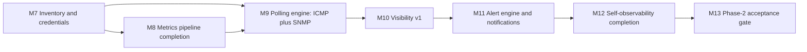

# PHASE-2 ENGINEERING SPECIFICATION
## Inventory, Polling, Visibility, Alerts - Argus Network Observability Platform

**Status:** ACCEPTED 2026-09-30. Section-3 review points are resolved: all
P2-D1..D7 recommendations are locked and the four consistency items are pinned
as proposed. Implementation proceeds milestone by milestone (M7 first) under
the Phase-1 slice discipline. Phase 1 is complete and gated (see
`docs/phase-1/ACCEPTANCE_RUN.md`; final Phase-1 gate PASS).

**Inputs (read first, do not redesign):**
`../argus-platform-spec/ARCHITECTURE.md` (canonical architecture; ADRs);
`../argus-platform-spec/docs/20-roadmap-build-order.md` (THE BUILD ORDER);
`../argus-platform-spec/docs/07-discovery-snmp.md` (inventory, credentials, polling);
`../argus-platform-spec/docs/08-metrics-topology.md` (rollups, cardinality, query);
`../argus-platform-spec/docs/10-alerts-diagnostics-rca.md` (alert engine v1);
`../argus-platform-spec/docs/11-data-database.md` (tables, retention, compression);
`../argus-platform-spec/docs/12-api.md` (endpoint conventions);
`../argus-platform-spec/docs/13-frontend.md` (UI requirements);
`../argus-platform-spec/docs/14-security-multisite-multitenant.md` (credentials, authz);
`../argus-platform-spec/docs/17-scale-reliability-retention.md` (perf budgets, retention matrix).

**Companions to be produced after approval:** `PHASE_2_FILE_PLAN.md`,
`PHASE_2_ACCEPTANCE.md` (per-milestone run records follow the
`ACCEPTANCE_RUN.md` style). Phase-1 documents are updated only where Phase 2
resolves their deferred items (G6, G11, G12, G14 notes) and only in the
milestone that resolves them.

---

# 1. PHASE-2 POSITION AND STEP MAPPING

Phase 2 is **build-order Steps 3-8** of the MVP: the first phase that adds
real monitoring value. It also completes the two Step-4/Step-8 areas Phase 1
deliberately deferred (metrics policies + optimization; self-observability
completion).

| Phase | Build-order steps | Content |
|---|---|---|
| Phase 1 (done) | Step 1, plus slices of Steps 2, 4, 8 | Walking skeleton: collector spine, identity, tenancy/RLS, ingest, query API, first chart, self-observability core |
| **Phase 2 (this spec)** | **Steps 3, 4 (remainder), 5, 6, 7, 8 (remainder)** | **Inventory + credentials, metrics completion, ICMP/SNMP polling, visibility (device/interface/site), alerts + notifications, self-observability completion** |
| Phase 3 (indicative) | Steps 9-13 | Discovery, topology + map, suppression v1, diagnostics, WAN |
| Phase 4 (indicative) | Steps 14-18 | Floor plans, Wi-Fi v1, HA + ops readiness, security gate, pilot |

Indicative phases are **not scoped**; they will get their own specs after
Phase 2. Nothing in Phase 3/4 is silently pulled into Phase 2.

**Milestones** (continuing the M-numbering for one repo history):

| Milestone | Build-order step | One-line goal | Phase-1 dependency |
|---|---|---|---|
| M7 | Step 3 | Devices, interfaces, identity history, groups; write-only envelope-encrypted credentials + bindings | Identity/org model (M4), RLS patterns (M1) |
| M8 | Step 4 (remainder) | Rollups, retention, compression, cardinality guards; ADR-016 ingest decision; L-01/L-02/L-03 resolved on measured evidence | M4c baselines, G6/G12 deferrals |
| M9 | Step 5 | Collector polling engine: ICMP, SNMP v2c/v3, core templates, counter correctness, adaptive scheduling, credential use flow, poll health | M7, M3 collector spine |
| M10 | Step 6 | Device/interface detail pages, status rollups, chart query API + charts, site dashboard v1 | M8, M9 |
| M11 | Step 7 | Alert engine v1: threshold/absence/rate rules, state machine, dedup, maintenance/silences; SMTP/webhook/Slack/Teams; delivery logs; SSE alert stream | M9, M10 |
| M12 | Step 8 (remainder) | Ops alert rules, dead-man switch, health page, collector lag dashboards | M11 |
| M13 | Gate (mirrors M6) | Phase-2 acceptance run: full regression + load/soak evidence + security delta + docs | All |

---

# 2. SCOPE

**In scope** (normative requirements are in the canonical docs; this spec adds
only the engineering gates, acceptance criteria and sequencing):

| Area | Included in Phase 2 |
|---|---|
| Inventory | Devices (manual add; SNMP-seeded add arrives with discovery in Phase 3), interfaces keyed `UQ(device_id, if_index)`, identity attributes + identity history, dynamic device groups (`selector jsonb`), org/site scoping, retirement policy (14 d unreachable, unpinned) |
| Credentials | Write-only secrets (never readable by any role, metadata only), envelope encryption (AES-256-GCM, per-secret DEK, KMS-wrapped with encryption context), bindings (`credential_bindings`: device/group/site + priority, enforced at dispatch), audited use, rotation |
| Polling | ICMP echo (availability/RTT/loss); SNMP v2c/v3; core templates (system, IF-MIB incl. HC 64-bit counters + errors/discards, hrProcessorLoad); counter wrap/reset/discontinuity correctness; adaptive scheduling/backoff/jitter; rate/safety limits; credential materialization over policy sync; poll health + error classification |
| Metrics completion | CAGGs `metric_1m/5m/1h/1d` + refresh policies; retention defaults (on-prem profile); compression policies; cardinality guards (per-device/per-site caps, quarantine, retirement); resolution picker; chart query budgets; ingest write-path optimization per ADR-016 (measured trigger); L-03 concurrency remediation |
| Visibility | Device detail (`/devices/:id`), interface detail (`/interfaces/:id`), site dashboard v1 (`/sites/:id`), status rollups, chart query API contract, chart UX rules (availability ribbon, brush, compare, resolution badge, heat strips), a11y |
| Alerts | Threshold/absence/rate rules (versioned JSON); evaluation semantics (`for_duration`, cadence cap, CAGG rules); state machine + `alert_events` timeline; fingerprint dedup; storm control + notify budget; ack/snooze/resolve/comment; maintenance windows + silences; SMTP/webhook/Slack/Teams with retries, breaker, delivery logs; default rule templates; webhook signing; SSE alert stream (first SSE consumer per G11) |
| Self-observability | Ops alert rules on a dedicated route; dead-man switch; platform health page; collector lag/queue/failure dashboards; system-org self-metrics retention (90 d raw + 13 mo rollups) |

**Explicitly out of scope** (deferred, with the owning phase; mirrors the
phase's build-order position):

| Component | Phase 2? | Owner / reason |
|---|---|---|
| Discovery v1 (sweep, SNMP classify, ARP/OUI, candidates) | NO | Step 9. Inventory ships with manual add + policy-driven targets; auto-discovery next phase. |
| Topology (LLDP/FDB, map, endpoint MAC->port) | NO | Steps 10-11. |
| Parent suppression via topology | NO | Step 11. Phase 2 ships only device-down -> child-device alert gating. |
| Diagnostics (traceroute/MTR/HTTP/TLS runs) | NO | Step 12. |
| WAN monitoring | NO | Step 13. |
| Floor plans, Wi-Fi v1 | NO | Steps 14-15. |
| HA collector pair, leader lease | NO | Step 16 (Phase 1 G3 still holds). |
| Incidents, RCA, composite/baseline rules, escalation | NO | V2 (incident timeline, correlation). Phase-2 grouping = fingerprint + storm control + budgets. |
| Config backup, IPAM, reports | NO | V2. |
| Multi-tenant SaaS, SSO/OIDC/MFA, MSP mode | NO | V2. |
| Heatmaps, wireless depth | NO | V2. |
| Flow ingestion, AI layer, automation, marketplace | NO | V3. |
| Windows collector, MSI, self-update | NO | V2. |
| SNMP traps/informs, syslog receive | NO | V2. |
| SSH/DHCP/WMI checks | NO | V2. |
| Certificate renewal RPC | NO | Deferred to the fleet/HA phase (Step 16); expiry remains surfaced (review point D4). |
| NATS JetStream | NO | G2 revalidation: alert evaluation stays in-process in Phase 2 (review point D3). |
| External KMS/HSM | NO | V2 (NFR-SEC-002); Phase 2 uses a dev-grade KMS binding behind the same envelope interface (review point D2). |

---

# 3. SCOPE DECISIONS AND REVIEW POINTS

Every item below needs an explicit accept/reject before implementation starts.
Recommendations are included; the default is the recommendation if you say
"go" without comments.

| ID | Decision | Recommendation | Why / alternatives |
|---|---|---|---|
| P2-D1 | Build order: M8 (Step 4 remainder) executes **before** M9 (Step 5 polling). | Keep canonical order (metrics backbone finalized before features depend on it). | Alternative: swap M8/M9 for faster visible polling value; then rollups/compression land against real polled data. Canonical order is safer; Phase-1 evidence (L-01/L-02) already exists for the optimization triggers either way. |
| P2-D2 | Dev KMS binding for envelope encryption. | Implement `SecretsVault` with a local master-key file backend (dev/on-prem single node) that preserves the canonical envelope shape (per-secret DEK, AES-256-GCM, encryption context, crypto-shredding); external KMS/HSM stays V2. | Canonical NFR-SEC-002 already defers external KMS to V2; a stand-in must not leak into the API/DB contract. |
| P2-D3 | Alert evaluation placement (G2 revalidation). | In-process scheduled evaluator (no NATS). Revisit ADR-014's internal half only when a second async consumer exists. | No async fan-out needed for one evaluator; a bus would add ops burden and mask DB behavior (same logic as Phase-1 G2). |
| P2-D4 | Certificate renewal RPC (G14 / ADR-017). | Defer to Step 16 (fleet/HA phase); keep expiry surfaced (API + metrics) and add an ops alert at <30 d remaining. | Dev/pilot cycles are < 90 d; renewal is coupled to fleet operations. Reject this recommendation if you want Phase-2 pilot runs > 60 d without manual re-enrollment. |
| P2-D5 | RBAC for new endpoints. | Increment: capability middleware + scoped bindings (org/site/device-group) for the new domains; full RBAC-SC conditions/enterprise features stay later. Every new endpoint declares a capability and the CI check enforces it (docs/12 §22.19). | The canonical model arrives progressively; retrofitting authz later is the expensive path. |
| P2-D6 | Alert suppression scope in Phase 2. | Only device-down -> child-device alert gating; topology-aware suppression at Step 11. Incidents are V2. | Prevents dependency on topology; keeps the "one incident not 200 alarms" promise partial and honestly labeled. |
| P2-D7 | Identity merge/split. | Ship identity history + manual merge/split with audit in M7; auto-merge/split detection waits for discovery evidence (Step 9). | Auto-merge keys rely on discovery/LLDP evidence; manual paths keep the model correct now. |

**Consistency items to pin down during Phase 2** (doc divergences found while
drafting; resolve once, then follow the pinned choice):

1. Rollup resolution picker: docs/08 §13.5 (`<=6 h raw/1m; <=7 d 5m; <=90 d 1h;
   beyond 1d`) vs docs/11 §20.4 wording - adopt docs/08 §13.5 and note it.
2. Per-device series cap: 250 (docs/08 §13.3) vs 200 "typical" (docs/11 §20.4)
   - adopt 250 as the default cap, template-configurable.
3. API base prefix: canonical docs/12 §22.1 says `/api/v1`; Phase 1 shipped
   `/v1/...`. Keep the shipped prefix (documented deviation) or align; decide
   in M7 so new endpoints are consistent.
4. MVP pilot criterion mentions "incident-grouped alert set" while incidents
   are V2; Phase-2 grouping = fingerprint families + storm control + budgets.
   The pilot criterion is re-read when incidents land.

---

# 4. MILESTONES, ACCEPTANCE CRITERIA, VERIFICATION

Every milestone follows the Phase-1 discipline: IMPLEMENT -> TEST -> VERIFY ->
DOCUMENT -> COMMIT, one slice at a time, with a **user-signed gate** before the
next milestone starts. Phase-1 suites (T1-T10, S-01-S-16, e2e, contract,
Playwright) must stay green at every gate.

## M7 - Inventory and credentials (Step 3)

**Goal:** devices and interfaces exist as first-class, tenant-safe objects,
with write-only secrets and bindings that the polling engine will use.

**Deliverables:** `devices`, `interfaces`, `device_identity_history`,
`device_groups`, `device_credentials`, `credential_bindings` (migrations from
`000008`); REST endpoints (`/devices`, `/interfaces`, `/device-groups`,
`/credentials` metadata + write/rotate + `:bind`); OpenAPI + contract tests;
audit events for every credential operation; UI list + detail skeleton for
devices (full detail page is M10).

**Acceptance criteria:**

- P2-AC-01: Manual device add/update/delete and interface CRUD work with
  org/site scoping; `UQ(device_id, if_index)` enforced; unique device identity
  within scope; cursor pagination + `application/problem+json` conventions on
  every new endpoint.
- P2-AC-02: Identity attributes (serial, chassis ID, sysObjectID, MACs,
  hostnames, mgmt IPs) recorded with identity history rows (first/last seen);
  manual merge/split with audit trail (P2-D7).
- P2-AC-03: Dynamic device groups (`selector jsonb`) CRUD; usable as a scope
  for credentials and (later) alert rules.
- P2-AC-04: Credentials are write-only: no role can read a secret back
  (metadata-only responses); use/rotate/bind/unbind are audited; bindings
  (device/group/site + priority) are enforced at dispatch - use outside
  bindings is impossible by construction and covered by tests.
- P2-AC-05: Envelope encryption at rest verified: per-secret DEK, AES-256-GCM,
  encryption-context binding; DB dump + log scan finds no plaintext secret;
  crypto-shredding path tested (delete key material -> data unreadable).
- P2-AC-06: Cross-tenant isolation extended to all new tables and endpoints
  (suite additions to the S-01..S-16 pattern, including direct-DB probes).

**Verification:** integration tests on the compose stack + testcontainers;
`S-` suite additions; DB-level checks run by CI.

## M8 - Metrics pipeline completion (Step 4 remainder; closes G6/G12)

**Goal:** the store is production-shaped: rollups, retention, compression,
cardinality guardrails, honest load numbers.

**Deliverables:** migrations for CAGGs (`metric_1m/5m/1h/1d`) + refresh,
compression and retention policies; resolution picker in the query API
(`meta.resolution`, raw fallback); cardinality guard (quarantine + event + UI
surfacing); retirement job; evaluator/query budget checks; ADR-016 decision
record + ingest optimization if triggered; L-03 remediation.

**Acceptance criteria:**

- P2-AC-07: CAGGs refresh within 2 min (1m policy `start_offset 7 d,
  end_offset 2 min`); queries fall back to raw for recent spans; rollups <= 2
  min behind verified by test.
- P2-AC-08: Resolution picker per docs/08 §13.5 with `meta.resolution`
  exposed; charts show the resolution badge (UI part lands in M10).
- P2-AC-09: Retention defaults applied for the on-prem profile (raw
  configurable 30-90 d, default 30; 1m 30 d; 5m 90 d; 1h 13 mo; 1d 3 y);
  nightly verification job raises an ops alert on failure (alert wiring lands
  in M12; until then it fails the job loudly).
- P2-AC-10: Compression enabled (segment by `series_id`, order `ts DESC`,
  after 7 d, 1-day chunks) with a measured compression ratio recorded in the
  phase load report (no vendor marketing numbers).
- P2-AC-11: Cardinality guards: default 250 series/device, 10k series/site,
  quarantine on runaway creation with `metric.cardinality.exceeded` event and
  UI surfacing; retired series after 30 d inactive; template compile-time
  budget check rejects over-budget templates in CI.
- P2-AC-12: Load evidence (re-run harness, honest reporting): sustained
  20k samples/s for >= 1 h with <= 5% counted backpressure drops; L-01 and
  L-02 re-measured against the optimized (or justified) write path per
  ADR-016; L-03 p95 <= 300 ms / p99 <= 1 s at 50 VUs with root cause
  addressed (pool/session instrumentation first, fix second - no production
  change without a measured cause).
- P2-AC-13: Query budget: p95 < 2 s for a 7-day window served from 1m
  rollups (NFR-PERF-002), and raw query caps (10k points / 100 series / 15 s)
  enforced with partial-result flags.

**Verification:** migration tests; CAGG correctness tests (aggregation policy
per metric type: avg/max/min, counter rates, state = max + time-weighted avg);
load harness runs recorded in `LOAD_TEST_REPORT`-style doc.

## M9 - Polling engine: ICMP + SNMP (Step 5)

**Goal:** real devices produce real series - availability, bandwidth (with
correct counter math), CPU - driven by policy-defined targets and
credentials delivered through the signed policy path.

**Deliverables:** collector scheduler with tiers; ICMP prober; SNMP client
(v2c/v3) + `mibgen` template pipeline; core template pack (system, IF-MIB incl.
HC counters, hrProcessorLoad); counter state machine (wrap/reset/discontinuity
-> reseed, no false spikes); adaptive backoff + jitter; rate/safety limits;
credential materialization in policy bundles (signed; per-session
ECDH+AEAD; RAM-only; last 3 bundles); `poll_health` table + events + API
surfacing; on-demand check endpoints (idempotency-keyed).

**Acceptance criteria:**

- P2-AC-14: ICMP echo produces availability/loss/RTT series from the
  collector for policy targets; scheduled and on-demand runs; raw-socket
  capability documented and working in the Linux collector.
- P2-AC-15: SNMP v2c (with warning) and v3 `authPriv` (preferred) supported;
  core templates produce series; tests run against pinned snmpsim fixtures;
  GETBULK `max-repetitions` 10-25 with GETNEXT fallback; per-RPC timeout 2 s /
  2 retries; **no SNMP SET is ever emitted** (test-asserted at the client
  boundary).
- P2-AC-16: Counter correctness under wrap/reset: 32-bit and 64-bit wraps,
  device reboot, `ifCounterDiscontinuityTime` change and `sysUpTime` drop all
  reseed without false spikes or negative rates; ifIndex rebinding is
  automatic and audited; fixture tests cover each case.
- P2-AC-17: Adaptive scheduling: default tiers (fast 30 s, standard 60 s,
  slow 5-15 min, inventory 6-24 h); consecutive failures double cadence to a
  15 min ceiling (critical devices 5 min); engine-level 30/60/300 s; all
  jittered +-10%; collector autonomy during a server outage (schedules keep
  executing; spool buffers).
- P2-AC-18: Safety limits enforced: one walk in flight per device; <= 300
  requests/min standard profile; per-tier session concurrency; ~100 global
  concurrent SNMP sessions; polling CPU-impact guard via `hrProcessorLoad`.
- P2-AC-19: Credential use flow: secrets delivered only inside signed policy
  bundles for bound devices/sites; materialized encrypted to the collector's
  ephemeral session key; RAM-only (no disk persistence, verified by scan);
  revocation stops use on next policy sync; secret never appears in logs
  (log scan test); bindings enforced server-side.
- P2-AC-20: Poll health recorded (`latency_ms`, `outcome`, `error_class`,
  `consecutive_failures`) with failure classification (timeout vs auth
  failure vs walk truncation vs template drift); exposed via API and used by
  the collector health views.

**Verification:** snmpsim fixtures + containerlab-lite (a compose target with
2-3 simulated devices); integration tests for counter math; failure-suite
additions (poll target disappears mid-run; credential revoked; collector
restart mid-poll). CI prerequisite: ICMP tests need NET_RAW (or unprivileged
ICMP) for the runner container - add to the runner setup checklist.

## M10 - Visibility v1 (Step 6)

**Goal:** the data is usable: device and interface pages answer "what is this
and how is it behaving", site dashboard answers "is this site healthy".

**Deliverables:** `POST /metrics/query` contract (+ `GET` convenience with
ETag), status rollups, device detail page, interface detail page (heat strips
for many ports), site dashboard v1, chart component rules, a11y pass.

**Acceptance criteria:**

- P2-AC-21: `POST /metrics/query` implements the canonical contract (series
  ids/selectors, from/to, step auto/30s/5m/1h, agg, fill) with caps and gap
  markers (no interpolation); `meta.resolution` present; ETag caching 15-60 s.
- P2-AC-22: Status rollups: per-device and per-interface status
  (up/down/unknown/maintenance) derived from poll health + maintenance state;
  site dashboard shows truthful counts.
- P2-AC-23: Device page: identity + history, interface list with utilization
  strips, metrics charts (availability ribbon + line/area + threshold bands),
  alerts section (empty until M11), <= 1.5 s p95 with warm API cache.
- P2-AC-24: Interface page: counters, errors/discards, speed, MTU, VLAN,
  MAC, connected-endpoint slot (populated from Phase 3 onward), heat-strip
  grid rather than N line charts at scale.
- P2-AC-25: Site dashboard v1: WAN/device/alert/floors/recent-change panels
  with URL-driven filters; "top questions in <= 3 clicks" rule; all lists
  filter/URL-driven.
- P2-AC-26: Chart UX: resolution badge always visible; brush-to-zoom;
  compare mode; status never color-only (WCAG 2.1 AA checks); LCP <= 2.5 s
  cold route; chart query p95 < 2 s over 7 d of 1m rollups.

**Verification:** Playwright suite additions (device/interface/site flows,
resolution toggle, empty/loading/error states); API contract tests; query
budget test in CI is evidence-recorded, not a hard blocker for every commit.

## M11 - Alert engine and notifications (Step 7; opens G11 SSE)

**Goal:** the platform tells operators what is wrong, once, with evidence and
without storms.

**Deliverables:** `alert_rules` (versioned), evaluator with state machine,
`alerts` + `alert_events`, dedup fingerprints, storm control + notify budget,
ack/snooze/resolve/comment, maintenance windows + silences, notification
channels (SMTP/webhook/Slack/Teams), delivery logs + retries/breaker,
default rule templates, outbound webhooks with HMAC, SSE alert stream.

**Acceptance criteria:**

- P2-AC-27: Rule types threshold/absence/rate_of_change with `for_duration`
  semantics (`agg(series.window) op value` continuously true); versioned
  immutable rules; `scope_selector` targeting; per-rule query timeout 5 s;
  windows >= 5 m read CAGGs; newest incomplete bucket never evaluated unless
  `allow_partial: true`.
- P2-AC-28: State machine Inactive -> Pending -> Active -> (Acknowledged /
  Snoozed / Suppressed) -> Resolved with `alert_events` timeline; recovery
  `for_duration` required; device-down resolves after 2 consecutive
  successful polls; `no_data` auto-resolves after 24 h as unknown; manual
  resolve requires capability + reason; metric->alert state change <= 60 s
  p95.
- P2-AC-29: Dedup: one open alert per fingerprint
  (`hash(rule, resource, dimension subset)`); repeats update value/time and
  append events; storm control > 20 new alerts/5 min per device -> suppressed
  (storm); per-site notify budget 30/h with digest coalescing; device-down
  suppression of child-device alerts (P2-D6).
- P2-AC-30: Ack/snooze/comment/resolve audited; snooze keeps evaluating and
  reactivates if still true; maintenance windows (recurring, scoped) and
  silences (mandatory expiry <= 30 d, reason) suppress notifications while
  still recording/evaluating; dashboards mark maintenance.
- P2-AC-31: Channels: SMTP, generic webhook (HMAC signature, replay window),
  Slack, Teams; at-least-once with dedup header; backoff 1m/5m/30m/2h/6h max
  24 h; per-channel circuit breaker (5 consecutive failures, half-open 5 min);
  token buckets 60/20/5 per hour by severity; duplicate-content suppression
  5 min; delivery logs (bodies 90 d, metadata 13 mo) + API; ops health alert
  when a channel exceeds 5% failures/15 min.
- P2-AC-32: Default rule templates shipped per device kind; sane out of the
  box (new device gets a curated set, no user config required for basic
  alerting).
- P2-AC-33: SSE `GET /streams/events` delivers `alert.*` (fired/resolved/
  updated) with 20 s heartbeats, `Last-Event-ID` resume (10 min buffer + PG
  replay), site filters; alert queue in the UI updates live; charts stay
  pull-based.
- P2-AC-34: Lifecycle e2e: unreachable device -> Active -> one notification
  to the test sink -> recovery -> Resolved, with exactly one notification per
  fingerprint per transition (dedup proven end to end).

**Verification:** evaluator unit tests (semantics, windows, partial buckets);
integration e2e with SMTP sink + webhook receiver containers; failure-suite
additions (channel down -> retry/breaker/dead-letter; alert storm; rule
edit while firing pins the firing version).

## M12 - Self-observability completion (Step 8 remainder)

**Goal:** the platform never runs blind: its own health is monitored by the
product's own alert engine.

**Deliverables:** platform self-metrics exposed as a system org (90 d raw +
13 mo rollups), ops rule pack (dedicated route), dead-man switch, health
page, collector lag/queue/failure dashboards.

**Acceptance criteria:**

- P2-AC-35: Ops rule pack on a dedicated route alerts on platform symptoms
  (ingest lag, evaluator stalls, queue growth, notification failures,
  cardinality quarantine spikes, retention/compression job failures).
- P2-AC-36: Dead-man switch: missing evaluator heartbeat / collector silence
  raises an ops alert within 5 min (simulated in tests); platform health page
  shows all green while the simulated outage is alerted - the Phase-1 pilot
  criterion #7 made true and tested.
- P2-AC-37: Collector lag/queue/failure dashboards backed by existing
  self-telemetry; health page links each red/yellow to the causal panel.

**Verification:** integration test with a stopped collector + stalled
evaluator; Playwright health-page states.

## M13 - Phase-2 acceptance gate

**Goal:** the phase is proven end to end, on the CI runner, with preserved
history.

- P2-AC-38: Full regression: T1-T10, S-01-S-16 (+ Phase-2 additions),
  e2e AC suite (+ device/alert scenarios), OpenAPI contract, proto
  lint/breaking, Playwright - all green on the self-hosted runner.
- P2-AC-39: Load/soak evidence recorded verbatim: 1 h at 20k samples/s;
  24 h pilot-profile run (synthetic hotel: ~120 devices, ~5k series) with
  zero loss/dupes and retention/compression observed active; numbers reported
  honestly, no capacity claims beyond measurement.
- P2-AC-40: Security delta review: authz capability matrix for every new
  endpoint (CI-enforced), no-plaintext-secret scan, credential-flow tests
  (bindings cannot be exceeded), isolation tests extended, envelope
  encryption verified; recorded in `PHASE_2_SECURITY.md`.
- P2-AC-41: Documentation: `PHASE_2_ACCEPTANCE.md` sign-off, runbook updates
  (polling ops, credential ops, alert ops, maintenance windows), versions
  pinned (`VERSIONS.md`), ADR updates (G6 resolved, G11 resolved, G12/ADR-016
  outcome, G2 revalidation note, G14 status).
- P2-AC-42: User-signed final gate with the Phase-1 provides/does-not-provide
  inventory updated for Phase 2.

---

# 5. CROSS-CUTTING ENGINEERING REQUIREMENTS

1. **Contracts first:** every new endpoint lands in `openapi/argus.v1.yaml`
   with capability mapping (CI fails on unmapped endpoints), contract tests
   updated; protocol changes are additive, `buf breaking` enforced; generated
   stubs committed with the existing CI drift check.
2. **Migrations:** from `000008`; expand/contract policy as Phase 1; down
   migrations for dev; every new table gets RLS or documented server-side
   scoping with a test.
3. **Idempotency & conventions:** `Idempotency-Key` on unsafe side-effect
   POSTs; cursor pagination; `application/problem+json` with stable codes;
   RFC 3339 ms UTC; soft delete where canonical docs say so.
4. **Authz:** capability middleware (P2-D5); every endpoint declares
   capability + scope; bindings inherit down the resource tree.
5. **Observability of new modules:** poll engine, evaluator, notifier emit
   their own metrics/logs (extending the §15 pattern); no new dependency on
   the NATS/Redis/object-storage set.
6. **CI:** keep the existing self-hosted runner pipeline green; add jobs for
   snmpsim fixtures, alert e2e (sinks), and the soak run (nightly/manual);
   runner prerequisite for ICMP tests (NET_RAW or unprivileged ICMP)
   documented in RUNBOOK §17.
7. **Testing strategy per milestone:** unit + fixture tests (snmpsim,
   counter math, evaluator semantics), integration on the compose stack,
   failure-suite additions (poll outage, channel outage, storm), security-suite
   additions (credential flows, new endpoint authz), e2e/Playwright additions.
8. **Versions:** pin snmpsim and any new test images in `VERSIONS.md`; no
   floating tags in the stack.

---

# 6. ASSUMPTIONS PHASE 2 EXISTS TO VALIDATE (OR FALSIFY)

| # | Assumption | Validated by |
|---|---|---|
| A1 | Credentials can be delivered to collectors over signed policy bundles, per-session encrypted, RAM-only, without weakening the write-only API guarantee | P2-AC-19, P2-AC-40 |
| A2 | Declarative SNMP templates + a counter state machine are correct under wraps/resets and vendor quirks | P2-AC-16, fixture matrix |
| A3 | A single collector can poll a hotel-class site within safety limits while staying autonomous during cloud outages | P2-AC-17/18, 24 h pilot-profile soak |
| A4 | CAGGs + compression + cardinality guards hold query budgets and storage growth honestly | P2-AC-07..13 |
| A5 | Alert semantics ("continuously true for `for_duration`", dedup, storms) produce one useful notification, not noise, in real e2e | P2-AC-27..34 |
| A6 | Capability-scoped authz on new domains preserves tenant isolation without a schema rewrite | P2-AC-06, P2-AC-40 |

---

# 7. GATE AND DEFINITION OF DONE

- One slice at a time: IMPLEMENT -> TEST -> VERIFY -> DOCUMENT -> COMMIT;
  each milestone ends with a **user-signed gate** (Phase-1 discipline
  unchanged).
- Definition of done per milestone: acceptance criteria met with evidence,
  Phase-1 regression green, contracts committed, docs updated in the same
  milestone, CI green on the self-hosted runner.
- Scope changes are allowed only as explicit amendments to this spec (never
  silently), mirroring Phase-1's "no redesign" rule.
- History is preserved: prior docs and measurements are not rewritten;
  Phase-2 documents append.

---

# 8. MILESTONE-TO-ACCEPTANCE SUMMARY

| Milestone | ACs | Primary evidence artifact |
|---|---|---|
| M7 | P2-AC-01..06 | integration + S-suite additions |
| M8 | P2-AC-07..13 | load report + migration/CAGG tests |
| M9 | P2-AC-14..20 | snmpsim/fixture matrix + failure-suite additions |
| M10 | P2-AC-21..26 | Playwright + contract tests + budget evidence |
| M11 | P2-AC-27..34 | alert e2e + delivery logs |
| M12 | P2-AC-35..37 | health-page tests + dead-man simulation |
| M13 | P2-AC-38..42 | `PHASE_2_ACCEPTANCE.md` sign-off |
